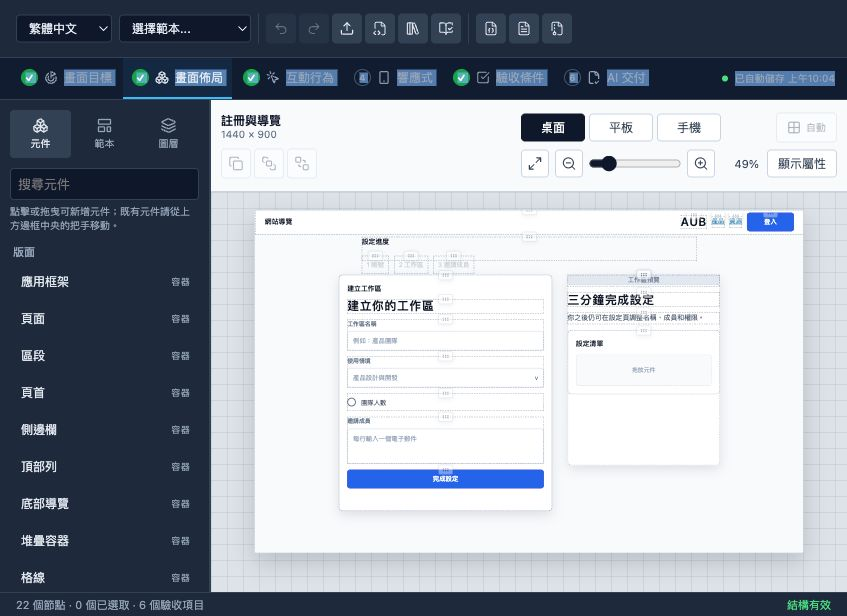
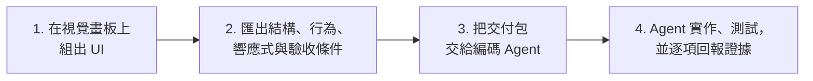

# AUB — UI Blueprint Agent（UI 藍圖代理工具）

**畫出介面，匯出 UI 合約，讓編碼 Agent 精準實作並驗收。**

[](https://github.com/HenryLau1103/AUB/actions/workflows/ci.yml)
[](./LICENSE)
[](./schema/ui-blueprint.schema.json)
[](./package.json)

[English](./README.md) · [Agent 交付指南](./docs/agent-handoff.zh-Hant.md) · [標準範例](./examples/dashboard.ui.json)



AUB 是一套視覺 UI 規格工具，協助使用者把畫面精準交給 Codex、Claude Code、GitHub Copilot 或其他編碼 Agent。你可以在畫板上組出畫面、宣告行為與驗收條件，再匯出結構化交付包，讓 Agent 不必只靠文字或截圖猜測。

> **線上 Demo：**[henrylau1103.github.io/AUB](https://henrylau1103.github.io/AUB/) — 編輯器完全在你的瀏覽器中執行。

## 運作方式



1. **視覺化組版**：從 18 個常用網站與應用範本開始，或直接在畫布上安排已註冊元件。
2. **匯出 UI 合約**：AUB 記錄語意階層、自動／自由佈局、各 viewport 精確位置、互動、design token、響應式規則與驗收條件。
3. **交給 Agent**：`.aub.zip` 會告訴 Agent 要讀什麼、要實作什麼，以及如何證明結果符合要求。

## 適合誰使用

- 需要比截圖或文字提示更精確的產品設計師與開發者。
- 使用編碼 Agent 實作儀表板、表單、內容產品、商務流程與應用框架的團隊。
- 需要 schema 驗證與可測試 UI 交換格式的 Agent 或工具開發者。
- 希望把既有 Angular 畫面轉成可重用 UI Blueprint 的團隊。

## AUB 解決什麼問題

「做一個像 Stripe 的 dashboard」或「做成像 Notion 一樣響應式」這類提示，會遺漏許多關鍵決策。截圖能表達外觀，卻無法交代元件意圖、互動結果、breakpoint、無障礙需求或驗收標準。

AUB 把這些決策變成明確合約：

- 使用已註冊的語意元件，不是匿名矩形。
- 明確定義階層與 layout，不讓 Agent 猜群組關係。
- 定義桌面、平板與手機行為，不只寫「要響應式」。
- 宣告互動與狀態，不讓 Agent 自行補劇情。
- 使用可測試的 acceptance id，不靠主觀感覺放行。

具體案例請看[純文字需求的失敗案例](./docs/failure-cases.md)。

## 本機快速開始

需求：Node.js 24+ 與 pnpm。

```bash
git clone https://github.com/HenryLau1103/AUB.git
cd AUB
pnpm install
(cd apps/editor && pnpm install && pnpm dev)
```

開啟 Vite 顯示的本機網址，通常是 `http://127.0.0.1:5173/`。

進入編輯器後：

1. 選擇範本。
2. 從元件上方中央把手拖曳，或從元件面板新增元件。
3. 完成畫面目標、畫面佈局、互動行為、響應式、驗收條件與 AI 交付。
4. 匯出 AI 交付包。

## 把 Blueprint 交給 Agent

匯出 `.aub.zip`，放進目標程式碼 repository，然後對 Agent 說：

```text
讀取這個 AUB 交付包中的 AGENT-README.md。
用我的語言向我說明交付包內容，檢查目前 repository，
實作 Blueprint、執行相關檢查，並逐項回報每個 acceptance id 的證據。
```

每個交付包都包含：

```text
AGENT-README.md
AGENT-README.zh-Hant.md
<screen>.ui.json
<screen>.ui.md
<screen>.agent.md
<screen>.codex.md
implementation-report.template.json
implementation-report.schema.json
screenshots/
  desktop.png
  tablet.png
  mobile.png
manifest.json
```

`<screen>.ui.json` 是唯一真實來源；Markdown 與截圖是輔助證據。Agent 在修改檔案前必須先讀取目標 repository 的規則，不得自行重新設計或降低驗收條件。

請閱讀完整的 [Agent 交付指南](./docs/agent-handoff.zh-Hant.md)。

## Agent 支援

| Agent | 支援方式 | 入口 |
|---|---|---|
| Codex | 專用 adapter | `<screen>.codex.md` 與 repository 的 `AGENTS.md` |
| Claude Code | 專用 adapter | 使用 `--adapter claude-code` 產生；讀取 `CLAUDE.md` |
| GitHub Copilot | 專用 adapter | 使用 `--adapter copilot` 產生；讀取 `.github/copilot-instructions.md` 與 `AGENTS.md` |
| 其他編碼 Agent | 通用交付 | `AGENT-README.md` 與 `<screen>.agent.md` |

核心 Blueprint 與 Agent 平台無關。Adapter 只調整執行指示，不會改變 schema、layout 語意、互動或驗收條件。

直接產生任務提示：

```bash
pnpm prompt examples/dashboard.ui.json dashboard.agent.md --adapter generic --task implement
pnpm prompt examples/dashboard.ui.json dashboard.codex.md --adapter codex --task implement
pnpm prompt examples/dashboard.ui.json dashboard.claude.md --adapter claude-code --task review
pnpm prompt examples/dashboard.ui.json dashboard.copilot.md --adapter copilot --task implement
```

支援的任務為 `author`、`plan`、`implement` 與 `review`。

## MCP server

支援 [Model Context Protocol](https://modelcontextprotocol.io) 的 Agent 可以直接透過 stdio 呼叫 AUB 工具，不需要把檔案複製進目標 repository：`list_blueprints`、`get_blueprint`、`validate_blueprint`、`export_prompt`、`submit_report`。

```bash
(cd apps/mcp-server && pnpm install && pnpm build)
node apps/mcp-server/dist/index.js /path/to/your/repo
```

在 Claude Code、Codex 或任何 MCP client 中註冊後即可使用。設定片段與說明請看 [`apps/mcp-server/README.md`](./apps/mcp-server/README.md)。Server 包裝的是與 CLI 相同的函式庫，schema、layout 語意、互動與驗收條件完全不變。

## Blueprint 描述的內容

- 由已註冊語意 UI 節點組成的樹狀結構。
- 使用 flex/grid 合約的自動佈局，或各 viewport 的自由佈局位置。
- 元件內容、design token、binding、狀態與限制。
- 使用者互動與可觀察結果。
- 針對命名 viewport 的響應式覆寫規則。
- 至少五項驗收條件，涵蓋 layout、interaction、responsive 與 accessibility。
- 既有程式碼匯入時可選擇保留來源與診斷資料。

主要格式：

| 格式 | 用途 |
|---|---|
| `.ui.json` | 機器驗證與唯一真實來源 |
| `.ui.yaml` | 人工編輯 |
| `.ui.md` | 自動生成的 Agent 與 reviewer 上下文 |
| `.ui.lock.json` | 凍結的驗收快照 |
| `.aub.zip` | 完整 Agent 交付包 |

## 既有畫面與 AI 生成流程

匯入 Angular HTML／SCSS／TS 元件檔案組：

```bash
pnpm import:angular path/to/component-directory \
  --entry app-example \
  --output example.ui.json
```

建立可攜式工具包，教 AI 產生有效的 AUB 檔案：

```bash
pnpm authoring:kit aub-authoring-kit.zip
```

工具包包含目前 schema、62 種元件 registry、標準範例、驗證指南與生成提示。詳細內容請看 [Angular 匯入](./docs/angular-import.md)與 [adapter 介面](./docs/agent-adapter-interface.md)。

## 驗證與審查

```bash
# 驗證 Blueprint
pnpm validate examples/dashboard.ui.json

# 將 v0.1／v0.2 升級為 v0.3
pnpm migrate old.ui.json migrated.ui.json

# 比較兩版 Blueprint
pnpm diff before.ui.json after.ui.json

# 建立並驗證 implementation report
pnpm report:init examples/dashboard.ui.json implementation-report.json
pnpm report:verify examples/dashboard.ui.json implementation-report.json
```

AUB 內建確定性的 Agent 可讀性評分，以及以瀏覽器執行的實作驗證。現有本機參考檢查涵蓋階層、幾何、layout mode、響應式 overflow、互動、無障礙狀態、截圖與報告完整性。

請參考 [Agent 可讀性測試](./benchmarks/agent-readability/README.md)與[實作基準測試](./benchmarks/agent-implementation/README.md)。

## 編輯器 / IDE 整合

Blueprint 檔案以 [`schema/ui-blueprint.schema.json`](./schema/ui-blueprint.schema.json) 為依據，因此編輯器可在你輸入時即時驗證並自動補全。

- **VS Code：**本 repo 內含 [`.vscode/settings.json`](./.vscode/settings.json)，會自動把 `*.ui.json` 與 `*.ui.yaml` 對應到 schema。請安裝建議的 [YAML 擴充套件](https://marketplace.visualstudio.com/items?itemName=redhat.vscode-yaml) 以支援 `.ui.yaml`。
- **獨立檔案／其他編輯器：**比照標準範例，加入指向 schema 的 `$schema` 欄位：

  ```json
  { "$schema": "../schema/ui-blueprint.schema.json", "version": "0.3.0" }
  ```

  YAML 則使用 YAML language server 指示行：

  ```yaml
  # yaml-language-server: $schema=../schema/ui-blueprint.schema.json
  ```

`$schema` 欄位為選填，AUB 工具會忽略它——它只用來驅動編輯器驗證。

## 專案狀態

- Blueprint schema 與語意驗證：已實作。
- WYSIWYG 編輯器，自由／自動佈局、拖曳、縮放、多選、畫板縮放、本地化與範本：已實作。
- JSON、Markdown、截圖、雜湊與 `.aub.zip` 交付：已實作。
- Codex、Claude Code 與 GitHub Copilot adapter：已實作。
- Angular 匯入、個人範本與 AI 生成工具包：已實作。
- Blueprint diff 與 implementation report 驗證：已實作。
- MCP server（stdio），提供 list／get／validate／export-prompt／submit-report 工具：已實作。
- 多畫面專案、UI 內 YAML 編輯與 editor 內 lock 產生：待辦。

目前格式版本為 `0.3.0`。請看 [schema 版本管理](./docs/schema-versioning.md)與[能力矩陣](./docs/capability-matrix.md)。

## Repository 結構

```text
schema/          JSON Schema、TypeScript 型別與元件 registry
scripts/         驗證、遷移、匯出、匯入、diff 與報告工具
examples/        標準 JSON、YAML、Markdown 與 lock 範例
apps/editor/     Vite + React 視覺編輯器
apps/mcp-server/ Model Context Protocol server（stdio），提供 Blueprint 工具
adapters/        各 Agent 專用提示 adapter
benchmarks/      Agent 可讀性與實作驗證
docs/            產品決策、指南、審查與驗收限制
tests/           所有合約的 Node 測試
```

Schema 是唯一真實來源。必須保持 [`schema/ui-blueprint.schema.json`](./schema/ui-blueprint.schema.json) 與 [`schema/types.ts`](./schema/types.ts) 同步。

## 貢獻方式

送出 PR 前：

```bash
pnpm test
pnpm typecheck
(cd apps/editor && pnpm typecheck)
(cd apps/editor && pnpm build)
(cd apps/mcp-server && pnpm typecheck && pnpm build)
pnpm validate examples/dashboard.ui.json
```

修改範圍應保持精簡、維持 round-trip 完整性，並且不得加入未註冊的語意元件類型。

## 部署（GitHub Pages）

landing 頁（`site/`）與編輯器 demo 由 [`.github/workflows/pages.yml`](./.github/workflows/pages.yml) 在每次 push 到 `main` 時發布到 [henrylau1103.github.io/AUB](https://henrylau1103.github.io/AUB/)。工作流程會以 `VITE_BASE=/AUB/editor/` 建置編輯器，並掛載在 `/AUB/editor/`。

一次性 repository 設定（無法由程式碼設定）：**Settings → Pages → Build and deployment → Source = GitHub Actions**。

在本機建置發布內容：

```bash
(cd apps/editor && VITE_BASE=/AUB/editor/ pnpm build)
mkdir -p _site/editor && cp -r site/. _site/ && cp -r apps/editor/dist/. _site/editor/
npx serve _site   # 開啟 http://localhost:3000/AUB/（路徑以 /AUB/ base 為準）
```

## 授權

本專案採用 [Apache License 2.0](./LICENSE)。
