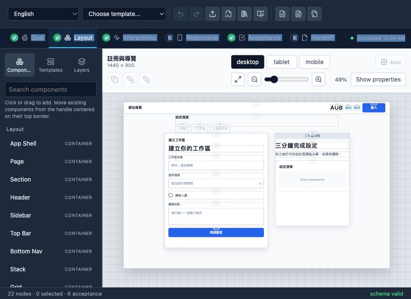
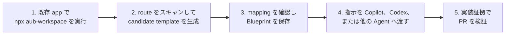

<p align="center">
  
</p>

# AUB — コーディング Agent に既存 UI を安全に変更させる

**コーディング Agent が既存プロダクト UI を安全に変更し、本番コンポーネントを作り直さず、証拠で PR を検証できるようにします。**

[](https://github.com/HenryLau1103/AUB/actions/workflows/ci.yml)
[](./LICENSE)
[](./schema/ui-blueprint.schema.json)
[](./package.json)

[English](./README.md) · [繁體中文](./README.zh-Hant.md) · [简体中文](./README.zh-Hans.md) · **日本語** · [한국어](./README.ko.md)

[Workspace loop ガイド](./docs/workspace-loop-user-manual.ja.md) · [GitHub agent workflow](./docs/github-agent-workflow.md) · [標準サンプル](./examples/dashboard.ui.json)



AUB は、コーディング Agent が実際の app を変更するための local-first ワークベンチです。既存 route をスキャンし、編集可能な Blueprint に変換し、カスタムコンポーネント候補を確認して、実装可能で検証可能な契約を Codex、Claude Code、GitHub Copilot などに渡します。

> **ライブ Demo：** [henrylau1103.github.io/AUB/ja](https://henrylau1103.github.io/AUB/ja/) — エディターはブラウザー内だけで動作します。

## 仕組み



1. **自分の app から開始**：既存プロジェクトの root で `npx aub-workspace` を実行します。AUB の clone は不要です。
2. **スキャンしてテンプレート化**：routes、components、layout の手がかり、カスタムコンポーネント候補を検出します。
3. **契約をレビュー**：candidate template を開き、mapping を確認し、Blueprint を調整します。
4. **Agent に渡す**：active Blueprint、route、preview URL、MCP tools を含む指示をコピーします。
5. **証拠で検証する**：すべての node mapping と acceptance id に証拠を要求し、GitHub Action で PR をゲートします。

## 既存プロジェクトの最短開始

既に app があり、AUB で MCP 経由の scan、template 生成、編集、preview を行いたい場合は、その app の root directory で実行します。

```bash
cd /path/to/your-existing-app
npx aub-workspace
```

これにより local AUB MCP server が起動し、bundled editor が開き、editor が workspace に自動接続されます。この方法では AUB repo を clone する必要はありません。

Editor では **Scan project → Generate template → Review component candidates → Save Blueprint/session → Copy agent instruction** の順に進めます。その指示を Copilot、Codex、または他の coding agent に渡し、実 app の変更と証拠報告を依頼します。

## AUB が解決する問題

「Stripe のような dashboard」や「Notion のように responsive」といった指示では、コンポーネント意図、操作結果、breakpoint、アクセシビリティ、受け入れ基準が不足します。AUB はそれらを明示的な契約にします。

- 匿名の矩形ではなく、登録済みセマンティックコンポーネント。
- 推測されたグループではなく、明示的な階層と layout。
- 「responsive にする」ではなく、desktop／tablet／mobile の動作。
- 推測された挙動ではなく、宣言済み interaction と state。
- 主観的承認ではなく、テスト可能な acceptance id。

## ローカルで開始

この手順は AUB 自体を開発する場合だけ使います。必要環境：Node.js 24+、pnpm。

```bash
git clone https://github.com/HenryLau1103/AUB.git
cd AUB
pnpm install
(cd apps/editor && pnpm install && pnpm dev)
```

Vite が表示する URL（通常 `http://127.0.0.1:5173/`）を開きます。

## コーディング Agent へ渡す

エディターから `.aub.zip` を書き出し、対象 repository に置いて Agent に次のように依頼します。

```text
この AUB パッケージの AGENT-README.md を読んでください。
内容を私の言語で説明し、この repository を確認して、
Blueprint を実装し、必要なチェックを実行し、
すべての acceptance id を証拠付きで報告してください。
```

パッケージには Blueprint JSON、派生 Markdown、Agent prompt、実装報告 schema、viewport 画像、SHA-256 manifest が含まれます。`<screen>.ui.json` が唯一の信頼できる情報源です。

## Agent 対応

| Agent | 対応 | エントリーポイント |
|---|---|---|
| Codex | 専用 adapter | `<screen>.codex.md` と `AGENTS.md` |
| Claude Code | 専用 adapter | `--adapter claude-code`、`CLAUDE.md` |
| GitHub Copilot | 専用 adapter | `--adapter copilot`、Copilot instructions と `AGENTS.md` |
| その他 | 汎用引き渡し | `AGENT-README.md` と `<screen>.agent.md` |

Adapter は実行指示だけを変更し、schema、layout、interaction、acceptance は変更しません。

## MCP server

23 個の MCP ツールを stdio または Streamable HTTP で提供します。Blueprint／project の検索、Figma／Penpot bridge import、検証済み write、handoff package、validation、scaffold、component resolve、prompt、diff、migration、lock、workspace session、project scan、template generation、custom component candidate review、implementation report を扱えます。

```bash
(cd apps/mcp-server && pnpm install && pnpm build)
node apps/mcp-server/dist/index.js /path/to/your/repo

# Streamable HTTP
node apps/mcp-server/dist/http.js --workspace /path/to/your/repo --port 3100
```

既存プロジェクトでは `aub-mcp-http` を起動し、AUB editor を `http://127.0.0.1:3100/mcp` に接続できます。Editor は workspace 内の Blueprint を直接 load/save し、`.aub/session.json`、`.aub/templates/*.aub.template.json`、`.aub/component-candidates.json` を扱い、実際の dev server route を preview できます。Scanner が見つけた custom component は必ず candidate file に入り、ユーザー承認後にのみ `aub.registry.json` へ書き込まれます。

完全な利用手順は [AUB Workspace Loop ユーザーマニュアル](./docs/workspace-loop-user-manual.ja.md) を参照してください。設定例は [`apps/mcp-server/README.md`](./apps/mcp-server/README.md) を参照してください。

## Blueprint 契約

| 形式 | 用途 |
|---|---|
| `.ui.json` | 機械検証と唯一の信頼できる情報源 |
| `.ui.yaml` | 人手による編集 |
| `.ui.md` | Agent／reviewer 向け派生コンテキスト |
| `.ui.lock.json` | 固定された受け入れ snapshot |
| `.aub.zip` | 完全な Agent 引き渡しパッケージ |

各 screen には、セマンティックノードツリー、auto／freeform layout、viewport geometry、content、token、binding、state、interaction、responsive rule、5 件以上の acceptance が含まれます。

## カスタム本番コンポーネント

62 種類のコア型は閉じた registry で管理されます。プロジェクト固有型は `aub.registry.json` に `acme:insight_card` のような namespaced 型として宣言します。`implementations` には本番 module、export、source、Storybook、props mapping を指定できます。

```bash
pnpm validate examples/extensions/analytics-insights.ui.json
pnpm validate path/to/screen.ui.json --registry ./aub.registry.json
```

Agent は MCP `resolve_component` を呼び、本番コンポーネントを再利用できます。

## インポートと生成

```bash
# Angular HTML／SCSS／TS
pnpm import:angular path/to/component-directory \
  --entry app-example \
  --output example.ui.json

# Figma／Penpot Design Bridge
pnpm import:design -- \
  examples/design-bridge/figma-hero.aub.bridge.json \
  --output marketing-hero.ui.json

# AI authoring kit
pnpm authoring:kit aub-authoring-kit.zip
```

Design Bridge は明示的なセマンティクスと完全な node mapping を要求し、レイヤー名からコンポーネントを推測しません。

## 検証、差分、報告

```bash
pnpm validate examples/dashboard.ui.json
pnpm migrate old.ui.json migrated.ui.json
pnpm diff before.ui.json after.ui.json
pnpm report:init examples/dashboard.ui.json implementation-report.json
pnpm report:verify examples/dashboard.ui.json implementation-report.json
```

不足している interaction、responsive、acceptance を非破壊で補完します。

```bash
pnpm scaffold path/to/screen.ui.json --write
```

## 複数画面プロジェクト

`*.aub.project.json` は複数の独立 Blueprint をパスで参照し、entry screen、共有 design system、navigation graph を宣言します。

```bash
pnpm project validate examples/project/app.aub.project.json
pnpm project init app.aub.project.json dashboard.ui.json settings.ui.json
pnpm project export-md examples/project/app.aub.project.json ./out
```

エディターは画面切り替え、追加／削除／名前変更、entry 設定、navigation 編集、project ZIP 書き出しに対応します。

## Pull Request 受け入れゲート

```yaml
- uses: HenryLau1103/AUB@main
  with:
    config: .aub/ci.json
    require-reports: "true"
```

Blueprint、project、extension registry、node mapping、acceptance evidence、unresolved work を検証します。ローカルでも同じ検証を実行できます。

```bash
pnpm ci:verify -- --workspace /path/to/target/repo --require-reports
```

## 現在の状態

- Blueprint schema、semantic validation、migration、diff、lock：実装済み。
- WYSIWYG エディター、18 テンプレート、複数画面 project、5 言語 landing page：実装済み。
- Angular、Figma／Penpot bridge import：実装済み。
- Codex、Claude Code、GitHub Copilot adapter：実装済み。
- stdio／HTTP MCP server、23 ツール：実装済み。
- Workspace-connected editor loop、local MCP HTTP、session、scanner-generated template、custom component candidate review、direct Blueprint save、implementation preview：実装済み。
- 本番 component mapping、implementation report、GitHub Action：実装済み。
- UI 内 YAML 編集、エディター内 lock 生成：backlog。

現在の format version は `0.3.0` です。

## マージ前チェック

```bash
pnpm test
pnpm typecheck
pnpm gen:check
pnpm site:locales:check
(cd apps/editor && pnpm typecheck && pnpm build)
(cd apps/mcp-server && pnpm typecheck && pnpm build && pnpm test)
pnpm validate examples/dashboard.ui.json
pnpm ci:verify -- --config examples/ci/aub.ci.json
```

## GitHub Pages

英語は `/AUB/`、繁体字中国語、簡体字中国語、日本語、韓国語は `/zh-hant/`、`/zh-hans/`、`/ja/`、`/ko/`、エディターは `/editor/` で公開されます。ページは一つの locale データから生成されます。

## ライセンス

[Apache License 2.0](./LICENSE)。
