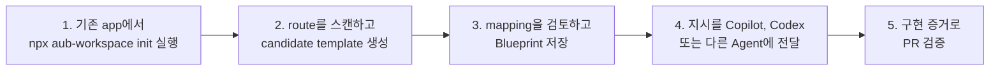

<p align="center">
  
</p>

# AUB — 코딩 Agent가 기존 UI를 안전하게 바꾸도록 돕기

**코딩 Agent가 기존 제품 UI를 안전하게 수정하고, 프로덕션 컴포넌트를 다시 만들지 않으며, 증거로 PR을 검증하게 합니다.**

[](https://github.com/HenryLau1103/AUB/actions/workflows/ci.yml)
[](./LICENSE)
[](./schema/ui-blueprint.schema.json)
[](./package.json)

[English](./README.md) · [繁體中文](./README.zh-Hant.md) · [简体中文](./README.zh-Hans.md) · [日本語](./README.ja.md) · **한국어**

[Workspace loop 가이드](./docs/workspace-loop-user-manual.ko.md) · [10분 demo](./docs/workspace-loop-10-minute-demo.md) · [GitHub agent workflow](./docs/github-agent-workflow.md) · [표준 예제](./examples/dashboard.ui.json)


AUB는 코딩 Agent가 실제 app을 수정할 때 쓰는 local-first 워크벤치입니다. 기존 route를 스캔해 편집 가능한 Blueprint로 만들고, 사용자 정의 컴포넌트 후보를 검토한 뒤, 구현 가능하고 검증 가능한 계약을 Codex, Claude Code, GitHub Copilot 또는 다른 Agent에 전달합니다.

> **라이브 Demo:** [henrylau1103.github.io/AUB/ko](https://henrylau1103.github.io/AUB/ko/) — 에디터는 브라우저 안에서만 실행됩니다.

## 작동 방식



1. **내 app에서 시작**: 기존 프로젝트 root에서 `npx aub-workspace init`을 실행한 뒤 `npx aub-workspace`를 실행합니다. AUB clone은 필요 없습니다.
2. **스캔하고 템플릿 생성**: routes, components, layout 단서와 사용자 정의 컴포넌트 후보를 감지합니다.
3. **계약 검토**: candidate template을 열고 mapping을 확인한 뒤 Blueprint를 조정합니다.
4. **Agent에게 전달**: active Blueprint, route, preview URL, MCP tools가 포함된 지시를 복사합니다.
5. **증거로 검증**: 모든 node mapping과 acceptance id에 증거를 요구하고 GitHub Action으로 PR을 게이트합니다.

## 기존 프로젝트에서 가장 빠르게 시작하기

이미 app 이 있고 AUB 로 MCP 기반 scan, template 생성, 편집, preview 를 하려면 그 app 의 root directory 에서 실행합니다.

```bash
cd /path/to/your-existing-app
npx aub-workspace init
npx aub-workspace
```

이 명령은 local AUB MCP server 를 시작하고 bundled editor 를 열며 editor 를 workspace 에 자동 연결합니다. 이 경로에서는 AUB repo 를 먼저 clone 할 필요가 없습니다.

`init` 은 AUB CI config, GitHub issue templates, Copilot instructions, PR workflow 를 설치합니다. Editor 에서는 **Scan project → Generate template → Review component candidates → Save Blueprint/session → Copy agent instruction** 순서로 진행합니다. 그 지시를 Copilot, Codex 또는 다른 coding agent 에 전달해 실제 app 변경과 증거 보고를 요청합니다.

## AUB가 해결하는 문제

“Stripe 같은 dashboard” 또는 “Notion처럼 responsive하게”라는 요청에는 컴포넌트 의도, 상호작용 결과, breakpoint, 접근성 요구사항과 인수 기준이 빠져 있습니다. AUB는 이를 명시적인 계약으로 바꿉니다.

- 익명 사각형이 아닌 등록된 시맨틱 컴포넌트.
- 추측한 그룹이 아닌 명시적 계층과 layout.
- “responsive하게”가 아닌 desktop／tablet／mobile 동작.
- 추측한 동작이 아닌 선언된 interaction과 state.
- 주관적 승인 대신 테스트 가능한 acceptance id.

## 로컬 빠른 시작

이 절차는 AUB 자체를 개발할 때만 사용합니다. 요구사항: Node.js 24+, pnpm.

```bash
git clone https://github.com/HenryLau1103/AUB.git
cd AUB
pnpm install
(cd apps/editor && pnpm install && pnpm dev)
```

Vite가 출력한 URL, 일반적으로 `http://127.0.0.1:5173/`을 엽니다.

## 코딩 Agent에 전달

에디터에서 `.aub.zip`을 내보내 대상 repository에 넣고 Agent에 다음과 같이 요청합니다.

```text
이 AUB 패키지의 AGENT-README.md를 읽으세요.
내용을 내 언어로 설명하고 현재 repository를 확인한 뒤,
Blueprint를 구현하고 관련 검사를 실행하며,
모든 acceptance id를 증거와 함께 보고하세요.
```

패키지에는 Blueprint JSON, 파생 Markdown, Agent prompt, 구현 보고서 schema, viewport 이미지와 SHA-256 manifest가 포함됩니다. `<screen>.ui.json`이 항상 단일 기준입니다.

## Agent 지원

| Agent | 지원 | 진입점 |
|---|---|---|
| Codex | 전용 adapter | `<screen>.codex.md`와 `AGENTS.md` |
| Claude Code | 전용 adapter | `--adapter claude-code`, `CLAUDE.md` |
| GitHub Copilot | 전용 adapter | `--adapter copilot`, Copilot instructions와 `AGENTS.md` |
| 기타 Agent | 범용 전달 | `AGENT-README.md`와 `<screen>.agent.md` |

Adapter는 실행 지침만 변경하며 schema, layout, interaction, acceptance는 변경하지 않습니다.

## MCP server

23개의 MCP 도구를 stdio 또는 Streamable HTTP로 제공합니다. Blueprint／project 탐색, Figma／Penpot bridge import, 검증된 write, handoff package, validation, scaffold, component resolve, prompt, diff, migration, lock, workspace session, project scan, template generation, custom component candidate review, implementation report를 지원합니다.

```bash
(cd apps/mcp-server && pnpm install && pnpm build)
node apps/mcp-server/dist/index.js /path/to/your/repo

# Streamable HTTP
node apps/mcp-server/dist/http.js --workspace /path/to/your/repo --port 3100
```

기존 프로젝트에서는 `aub-mcp-http`를 실행하고 AUB editor를 `http://127.0.0.1:3100/mcp`에 연결할 수 있습니다. Editor는 workspace의 Blueprint를 직접 load/save하고, `.aub/session.json`, `.aub/templates/*.aub.template.json`, `.aub/component-candidates.json`을 다루며 실제 dev server route를 preview합니다. Scanner가 찾은 custom component는 항상 candidate file에 먼저 들어가고, 사용자가 승인한 뒤에만 `aub.registry.json`에 기록됩니다.

전체 사용 흐름은 [AUB Workspace Loop 사용자 매뉴얼](./docs/workspace-loop-user-manual.ko.md)을 참고하세요. 설정 예시는 [`apps/mcp-server/README.md`](./apps/mcp-server/README.md)를 참고하세요.

## Blueprint 계약

| 형식 | 용도 |
|---|---|
| `.ui.json` | 기계 검증과 단일 기준 |
| `.ui.yaml` | 사람이 편집 |
| `.ui.md` | Agent／reviewer용 파생 컨텍스트 |
| `.ui.lock.json` | 고정된 인수 snapshot |
| `.aub.zip` | 전체 Agent 전달 패키지 |

각 screen에는 시맨틱 노드 트리, auto／freeform layout, viewport geometry, content, token, binding, state, interaction, responsive rule과 5개 이상의 acceptance가 포함됩니다.

## 사용자 정의 프로덕션 컴포넌트

62개 핵심 유형은 폐쇄형 registry로 관리됩니다. 프로젝트 전용 유형은 `aub.registry.json`에 `acme:insight_card` 같은 namespaced 유형으로 선언합니다. `implementations`에는 프로덕션 module, export, source, Storybook, props mapping을 지정할 수 있습니다.

```bash
pnpm validate examples/extensions/analytics-insights.ui.json
pnpm validate path/to/screen.ui.json --registry ./aub.registry.json
```

Agent는 MCP `resolve_component`를 호출해 실제 프로덕션 컴포넌트를 재사용할 수 있습니다.

## 가져오기와 생성

```bash
# Angular HTML／SCSS／TS
pnpm import:angular path/to/component-directory \
  --entry app-example \
  --output example.ui.json

# Figma／Penpot Design Bridge
pnpm import:design -- \
  examples/design-bridge/figma-hero.aub.bridge.json \
  --output marketing-hero.ui.json

# AI authoring kit
pnpm authoring:kit aub-authoring-kit.zip
```

Design Bridge는 명시적 시맨틱과 완전한 node mapping을 요구하며 레이어 이름에서 컴포넌트 의미를 추측하지 않습니다.

## 검증, 차이, 보고

```bash
pnpm validate examples/dashboard.ui.json
pnpm migrate old.ui.json migrated.ui.json
pnpm diff before.ui.json after.ui.json
pnpm report:init examples/dashboard.ui.json implementation-report.json
pnpm report:verify examples/dashboard.ui.json implementation-report.json
pnpm report:capture -- --workspace /path/to/app --blueprint screens/settings.ui.json --url http://localhost:3000/settings
pnpm report:verify screens/settings.ui.json .aub/reports/workspace.settings.implementation-report.json --require-evidence
```

누락된 interaction, responsive, acceptance를 비파괴적으로 보완합니다.

```bash
pnpm scaffold path/to/screen.ui.json --write
```

## 다중 화면 프로젝트

`*.aub.project.json`은 여러 독립 Blueprint를 경로로 참조하고 entry screen, 공유 design system, navigation graph를 선언합니다.

```bash
pnpm project validate examples/project/app.aub.project.json
pnpm project init app.aub.project.json dashboard.ui.json settings.ui.json
pnpm project export-md examples/project/app.aub.project.json ./out
```

에디터는 화면 전환, 추가／삭제／이름 변경, entry 설정, navigation 편집, project ZIP 내보내기를 지원합니다.

## Pull Request 인수 게이트

```yaml
- uses: HenryLau1103/AUB@main
  with:
    config: .aub/ci.json
    require-reports: "true"
    require-evidence: "false"
```

Blueprint, project, extension registry, node mapping, acceptance evidence, unresolved work를 검증합니다. 로컬에서도 동일한 검증을 실행할 수 있습니다.

```bash
pnpm ci:verify -- --workspace /path/to/target/repo --require-reports
pnpm ci:verify -- --workspace /path/to/target/repo --require-reports --require-evidence
```

## 현재 상태

- Blueprint schema, semantic validation, migration, diff, lock: 구현 완료.
- WYSIWYG 에디터, 18개 템플릿, 다중 화면 project, 5개 언어 landing page: 구현 완료.
- Angular, Figma／Penpot bridge import: 구현 완료.
- Codex, Claude Code, GitHub Copilot adapter: 구현 완료.
- stdio／HTTP MCP server, 23개 도구: 구현 완료.
- One-command workspace initialization(`npx aub-workspace init`): CI config, issue templates, Copilot instructions, PR workflow: 구현 완료.
- Workspace-connected editor loop, local MCP HTTP, session, scanner-generated template, custom component candidate review, direct Blueprint save, implementation preview: 구현 완료.
- Implementation evidence capture: viewport screenshot, DOM query, overflow, report evidence verification: 구현 완료.
- 프로덕션 component mapping, implementation report, GitHub Action: 구현 완료.
- UI 내 YAML 편집, 에디터 내 lock 생성: backlog.

현재 format version은 `0.3.0`입니다.

## 병합 전 검사

```bash
pnpm test
pnpm typecheck
pnpm gen:check
pnpm site:locales:check
(cd apps/editor && pnpm typecheck && pnpm build)
(cd apps/mcp-server && pnpm typecheck && pnpm build && pnpm test)
pnpm validate examples/dashboard.ui.json
pnpm ci:verify -- --config examples/ci/aub.ci.json
```

## GitHub Pages

영어는 `/AUB/`, 번체 중국어, 간체 중국어, 일본어, 한국어는 각각 `/zh-hant/`, `/zh-hans/`, `/ja/`, `/ko/`, 에디터는 `/editor/`에서 제공됩니다. 페이지는 하나의 locale 데이터에서 생성됩니다.

## 라이선스

[Apache License 2.0](./LICENSE).
