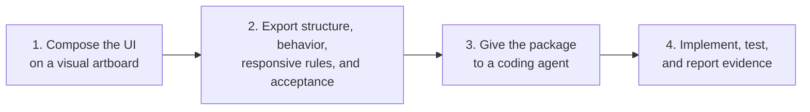

<p align="center">
  
</p>

# AUB — UI Blueprint Agent

**Define the UI contract. Reuse production components. Gate implementation on evidence.**

[](https://github.com/HenryLau1103/AUB/actions/workflows/ci.yml)
[](./LICENSE)
[](./schema/ui-blueprint.schema.json)
[](./package.json)

**English** · [繁體中文](./README.zh-Hant.md) · [简体中文](./README.zh-Hans.md) · [日本語](./README.ja.md) · [한국어](./README.ko.md)

[Agent handoff guide](./docs/agent-handoff.md) · [Canonical example](./examples/dashboard.ui.json)


AUB is the open, agent-neutral contract layer between product intent and implementation. Build a semantic screen or multi-screen project, map custom types to production components, hand the same versioned contract to Codex, Claude Code, GitHub Copilot, or another coding agent, then verify every acceptance id in CI.

> **Live demo:** [henrylau1103.github.io/AUB](https://henrylau1103.github.io/AUB/) — the editor runs entirely in your browser.

## How it works



1. **Compose or import** — start from one of 18 templates, arrange registered components, or import Angular and Figma/Penpot Design Bridge sources.
2. **Bind production components** — map custom semantic types to framework modules, exports, source files, Storybook, docs, and props.
3. **Hand off one contract** — use an `.aub.zip` or MCP without changing schema or acceptance semantics between agents.
4. **Verify the implementation** — require node mappings and evidence for every acceptance id, then enforce them with the bundled GitHub Action.

## Who AUB is for

- Product designers and developers who need more precision than a screenshot or prose prompt.
- Teams using coding agents to implement dashboards, forms, content products, commerce flows, and application shells.
- Agent and tooling developers who need a schema-valid, testable UI interchange format.
- Design-system teams that want agents to reuse production components instead of creating lookalikes.
- Teams converting existing Angular screens into reusable UI Blueprints.

## Fastest path for an existing project

If you already have an app and want AUB to scan, template, edit, and preview it through MCP, run this from that app's root directory:

```bash
cd /path/to/your-existing-app
npx aub-workspace
```

This starts the local AUB MCP server, opens the bundled editor, and connects the editor to your workspace automatically. You do not need to clone the AUB repo for this path.

## The problem AUB solves

Prompts such as "build a dashboard like Stripe" or "make this responsive like Notion" leave critical decisions unstated. A screenshot shows appearance but not component intent, interaction outcomes, breakpoints, accessibility requirements, or the acceptance bar.

AUB turns those decisions into an explicit contract:

- Registered semantic component types instead of anonymous rectangles.
- Hierarchy and layout rules instead of inferred grouping.
- Desktop, tablet, and mobile behavior instead of "make it responsive."
- Declared interactions and states instead of guessed behavior.
- Testable acceptance ids instead of subjective approval.

See [failure cases](./docs/failure-cases.md) for concrete examples.

## Local quick start

Use this path only when developing AUB itself. Requirements: Node.js 24+ and pnpm.

```bash
git clone https://github.com/HenryLau1103/AUB.git
cd AUB
pnpm install
(cd apps/editor && pnpm install && pnpm dev)
```

Open the local URL printed by Vite, normally `http://127.0.0.1:5173/`.

In the editor:

1. Choose a template.
2. Drag components from their top-center handle or add components from the palette.
3. Complete Goal, Layout, Interactions, Responsive, Acceptance, and Handoff.
4. Export the AI handoff package.

## Give a Blueprint to an agent

Export an `.aub.zip`, place it in the target code repository, and tell the agent:

```text
Read AGENT-README.md in this AUB handoff package.
Explain the package to me in my language, inspect this repository,
implement the Blueprint, run the relevant checks, and report every acceptance id with evidence.
```

Every handoff package contains:

```text
AGENT-README.md
AGENT-README.zh-Hant.md
<screen>.ui.json
<screen>.ui.md
<screen>.agent.md
<screen>.codex.md
implementation-report.template.json
implementation-report.schema.json
screenshots/
  desktop.png
  tablet.png
  mobile.png
manifest.json
```

`<screen>.ui.json` is the source of truth. Markdown and screenshots are supporting evidence. The agent must inspect the target repository's own instructions before editing and must not redesign or weaken acceptance criteria.

Read the full [Agent handoff guide](./docs/agent-handoff.md).

## Agent support

| Agent | Support | Entry point |
|---|---|---|
| Codex | Dedicated adapter | `<screen>.codex.md` and repository `AGENTS.md` |
| Claude Code | Dedicated adapter | Generate with `--adapter claude-code`; reads `CLAUDE.md` |
| GitHub Copilot | Dedicated adapter | Generate with `--adapter copilot`; reads `.github/copilot-instructions.md` + `AGENTS.md` |
| Other coding agents | Generic handoff | `AGENT-README.md` and `<screen>.agent.md` |

The core Blueprint is agent-neutral. Adapters change execution instructions, not schema, layout semantics, interactions, or acceptance criteria.

Generate a prompt directly:

```bash
pnpm prompt examples/dashboard.ui.json dashboard.agent.md --adapter generic --task implement
pnpm prompt examples/dashboard.ui.json dashboard.codex.md --adapter codex --task implement
pnpm prompt examples/dashboard.ui.json dashboard.claude.md --adapter claude-code --task review
pnpm prompt examples/dashboard.ui.json dashboard.copilot.md --adapter copilot --task implement
```

Supported tasks are `author`, `plan`, `implement`, and `review`.

## MCP server

Instead of copying files into the target repository, agents that speak the
[Model Context Protocol](https://modelcontextprotocol.io) can call AUB tools directly over
stdio or Streamable HTTP. The 23 tools cover Blueprint/project discovery, Figma/Penpot bridge
import, validated writes, handoff packaging, validation, scaffolding, component resolution,
prompt export, diff, migration, locking, workspace sessions, app scanning, template generation,
component candidate review, and implementation-report submission.

For most users, start inside the existing app you want AUB to work on:

```bash
cd /path/to/existing-app
npx aub-workspace
```

This starts the local MCP HTTP server, serves the bundled AUB editor, connects
the editor to the workspace, and opens the browser. No AUB clone is required for
this path once `aub-workspace` is published to npm.

For AUB repo development, run from the AUB repo root:

```bash
pnpm workspace:start -- --workspace /path/to/existing-app
```

Manual MCP server startup remains available for agent/client configuration:

```bash
(cd apps/mcp-server && pnpm install && pnpm build)
node apps/mcp-server/dist/index.js /path/to/your/repo
# Or expose the same tools over Streamable HTTP
node apps/mcp-server/dist/http.js --workspace /path/to/your/repo --port 3100
```

Register it with Claude Code, Codex, or any MCP client. See
[`apps/mcp-server/README.md`](./apps/mcp-server/README.md) for configuration snippets. The
server wraps the same libraries as the CLI, so schema, layout semantics, interactions, and
acceptance criteria are unchanged.

### Workspace-connected editor loop

For an existing app, the one-command path is:

```bash
cd /path/to/existing-app
npx aub-workspace
```

The command opens the editor already connected to the local MCP endpoint. The
editor uses the same server process to load and save Blueprints, update
`.aub/session.json`, review `.aub/templates/*.aub.template.json`, approve
`.aub/component-candidates.json`, and preview the app's local dev route. Coding
agents continue to use MCP tools such as `get_aub_session`, `get_blueprint`,
`resolve_component`, and `write_blueprint`.

Read the full [Workspace Loop user manual](./docs/workspace-loop-user-manual.md).

Agents can bootstrap the loop from existing code:

```text
scan_project_ui
generate_template_from_source { "sourcePath": "app/settings/page.tsx" }
export_template_authoring_prompt
```

Scanner output is candidate-first: custom components go to
`.aub/component-candidates.json` and only become `aub.registry.json` extension
types after user approval.

## What the Blueprint describes

- A tree of registered semantic UI nodes.
- Auto layout with flex/grid contracts or freeform per-viewport placements.
- Component content, design tokens, bindings, states, and constraints.
- User interactions and observable outcomes.
- Responsive overrides for named viewports.
- At least five acceptance criteria spanning layout, interaction, responsive behavior, and accessibility.
- Optional provenance for imported source files and diagnostics.

Primary formats:

| Format | Use |
|---|---|
| `.ui.json` | Machine validation and source of truth |
| `.ui.yaml` | Human editing |
| `.ui.md` | Generated agent and reviewer context |
| `.ui.lock.json` | Frozen acceptance snapshot |
| `.aub.zip` | Complete agent handoff |

## Custom component types

The 62 core component types are curated and closed so every type has a meaning agents can resolve. Projects that need bespoke components declare **namespaced extension types** in an `aub.registry.json` at the project root, using a `team:component` namespace (e.g. `acme:insight_card`). They are validated, resolvable, and bundled into handoffs — never free-guessed.

Extension entries can also map the semantic type to production implementations:

```json
{
  "name": "acme:insight_card",
  "isContainer": true,
  "implementations": [{
    "id": "react",
    "framework": "react",
    "module": "@acme/analytics-ui",
    "export": "InsightCard",
    "sourcePath": "packages/analytics-ui/src/InsightCard.tsx",
    "storybookUrl": "https://storybook.example.com/?path=/story/insight-card--default",
    "props": {
      "title": { "from": "content.title", "required": true }
    }
  }]
}
```

Agents can call MCP `resolve_component` to retrieve the exact mapping before implementation.

```bash
# Auto-discovers aub.registry.json from the file's directory upward
pnpm validate examples/extensions/analytics-insights.ui.json

# Or point at a specific registry
pnpm validate path/to/screen.ui.json --registry ./aub.registry.json
```

See [custom component types](./docs/custom-components.md) and the worked example in [`examples/extensions/`](./examples/extensions/).

## Existing-screen and AI authoring workflows

Import an Angular HTML/SCSS/TS component bundle:

```bash
pnpm import:angular path/to/component-directory \
  --entry app-example \
  --output example.ui.json
```

Import an explicitly mapped Figma or Penpot Design Bridge:

```bash
pnpm import:design -- \
  examples/design-bridge/figma-hero.aub.bridge.json \
  --output marketing-hero.ui.json
```

Create a portable kit that teaches an AI to author valid AUB files:

```bash
pnpm authoring:kit aub-authoring-kit.zip
```

The kit includes the current schema, 62-component registry, canonical example, validation guide, and authoring prompt. See [Angular import](./docs/angular-import.md), the [Figma/Penpot Design Bridge](./docs/design-tool-bridge.md), and the [adapter interface](./docs/agent-adapter-interface.md).

## Validate and review

```bash
# Validate a Blueprint
pnpm validate examples/dashboard.ui.json

# Migrate v0.1/v0.2 to v0.3
pnpm migrate old.ui.json migrated.ui.json

# Compare Blueprint revisions
pnpm diff before.ui.json after.ui.json

# Create and verify an implementation report
pnpm report:init examples/dashboard.ui.json implementation-report.json
pnpm report:verify examples/dashboard.ui.json implementation-report.json
```

### Scaffold spec sections

Deterministically derive the spec sections that are easy to leave empty —
`interactions`, `responsive`, and `acceptance` — from the existing node tree and
viewports. Scaffolding is **non-destructive**: it only appends missing items
(and tops acceptance up to the required five criteria with layout / interaction /
responsive / a11y coverage), never overwriting or reordering your content. Run it
twice and the second pass changes nothing.

```bash
# Preview to stdout
pnpm scaffold examples/dashboard.ui.json --stdout

# Write the scaffolded sections back into the file
pnpm scaffold path/to/screen.ui.json --write

# Only scaffold specific sections, and localize generated statements
pnpm scaffold path/to/screen.ui.json --sections acceptance,responsive --language zh-Hant --write
```

In the editor, each spec list (Interactions, Responsive, Acceptance) has a
**Suggest from layout** button that runs the same logic. Agents over MCP can call
the `scaffold_blueprint` tool to get a fully specced blueprint before handing it
off for implementation.

### Multi-screen projects

A single `.ui.json` is one screen. To compose several screens into a navigable
product, AUB uses a reference-based **project** document (`*.aub.project.json`)
that lists member Blueprint files by path, declares a navigation graph, names an
entry screen, and optionally carries a shared design system. Member screens stay
fully valid standalone Blueprints, and the Blueprint schema is unchanged.

```bash
# Validate a project (schema + project semantics + every member screen)
pnpm project validate examples/project/app.aub.project.json

# Wrap existing single screens into a new project (entry = first)
pnpm project init app.aub.project.json dashboard.ui.json settings.ui.json

# Emit a project overview .md plus per-screen agent context
pnpm project export-md examples/project/app.aub.project.json ./out
```

The editor can open a project, switch between screens, add/remove/rename screens,
set the entry screen, edit the navigation graph, and save the whole project as a
`.zip`. Agents over MCP get `list_projects` / `get_project` / `validate_project`.
See [multi-screen projects](./docs/multi-screen.md).

### Canvas resolution

Each viewport's resolution is configurable in the editor: pick a common preset
(1440×900, 1920×1080, iPad, iPhone, Android, …) or type any custom width × height
(clamped to the schema's 320–7680 × 320–4320 range). Resolutions are stored on the
Blueprint's `viewports`, so they travel with the file.

AUB includes deterministic agent-readability and browser-based implementation benchmarks. The current local reference checks cover hierarchy, geometry, layout mode, responsive overflow, interactions, accessibility states, screenshots, and report completeness.

See [agent readability](./benchmarks/agent-readability/README.md) and [implementation benchmark](./benchmarks/agent-implementation/README.md).

### Pull-request acceptance gate

Add `.aub/ci.json` to the implementation repository, then use the bundled GitHub Action:

```yaml
- uses: HenryLau1103/AUB@main
  with:
    config: .aub/ci.json
    require-reports: "true"
```

The check validates Blueprints, projects, extension registries, node mappings, acceptance
evidence, and unresolved work. Run the same verification locally with:

```bash
pnpm ci:verify -- --workspace /path/to/target/repo --require-reports
```

See [GitHub CI acceptance gate](./docs/github-ci.md).

## Editor / IDE integration

Blueprint files are backed by the JSON Schema at [`schema/ui-blueprint.schema.json`](./schema/ui-blueprint.schema.json), so editors can validate and autocomplete them as you type.

- **VS Code:** this repo ships [`.vscode/settings.json`](./.vscode/settings.json), which maps `*.ui.json` and `*.ui.yaml` to the schema automatically. Install the recommended [YAML extension](https://marketplace.visualstudio.com/items?itemName=redhat.vscode-yaml) for `.ui.yaml` support.
- **Standalone files / other editors:** add a `$schema` key pointing at the schema, as the canonical examples do:

  ```json
  { "$schema": "../schema/ui-blueprint.schema.json", "version": "0.3.0" }
  ```

  For YAML, use the YAML language server directive:

  ```yaml
  # yaml-language-server: $schema=../schema/ui-blueprint.schema.json
  ```

The `$schema` key is optional and ignored by AUB tooling — it only drives editor validation.

## Project status

- Blueprint schema and semantic validation: implemented.
- WYSIWYG editor with freeform/auto layout, drag, resize, multi-select, zoom, localization, and templates: implemented.
- JSON, Markdown, screenshots, hashes, and `.aub.zip` handoff: implemented.
- Codex, Claude Code, and GitHub Copilot adapters: implemented.
- Angular import, Figma/Penpot semantic bridge, personal templates, and AI authoring kit: implemented.
- Blueprint diff and implementation report verification: implemented.
- MCP server (stdio + Streamable HTTP) exposing 23 tools including Design Bridge import, validated writes, handoff packaging, discovery, validation, component resolution, scaffolding, diff, migration, locks, workspace sessions, app scanning, template generation, candidate review, and reports: implemented.
- Workspace-connected editor loop for local MCP HTTP, session state, scanner-generated templates, component candidate review, direct Blueprint save, and implementation preview: implemented.
- Production component mappings in `aub.registry.json`: implemented.
- GitHub Action and local CI verifier for contracts plus implementation evidence: implemented.
- Multi-screen projects (reference-based `.aub.project.json`, CLI, MCP tools, editor screen switcher + navigation): implemented.
- Configurable canvas resolution (presets + custom width/height): implemented.
- Localized GitHub Pages and README files in English, Traditional Chinese, Simplified Chinese, Japanese, and Korean: implemented.
- YAML editing in the UI and editor-side lock generation: backlog.

The current format version is `0.3.0`. See [schema versioning](./docs/schema-versioning.md) and [capability matrix](./docs/capability-matrix.md).

## Repository map

```text
schema/          JSON Schema, TypeScript types, component registry, CI contract
scripts/         Validation, migration, export, import, diff, and report tools
examples/        Canonical JSON, YAML, Markdown, and lock fixtures
apps/editor/     Vite + React visual editor
apps/mcp-server/ Model Context Protocol server (stdio + Streamable HTTP)
adapters/        Agent-specific prompt adapters
benchmarks/      Agent readability and implementation verification
docs/            Product decisions, guides, audits, and acceptance constraints
tests/           Node test suites for all contracts
```

The component registry is the single source of truth for component types. [`schema/registry/components.json`](./schema/registry/components.json) drives the schema enums and [`schema/types.ts`](./schema/types.ts); run `pnpm gen` after editing it and `pnpm gen:check` verifies they are in sync (CI enforces this).

## Contributing

Before opening a PR:

```bash
pnpm test
pnpm typecheck
pnpm gen:check
(cd apps/editor && pnpm typecheck)
(cd apps/editor && pnpm build)
pnpm validate examples/dashboard.ui.json
pnpm ci:verify -- --config examples/ci/aub.ci.json
```

To add a **core** component type, edit `schema/registry/components.json` and run `pnpm gen` — the schema enums and TypeScript unions regenerate from it. To add a **project-specific** component without forking core, declare a namespaced extension type in `aub.registry.json` (see [custom component types](./docs/custom-components.md)).

Keep changes scoped, preserve round-trip integrity, and do not invent unregistered semantic component types — every type must be either a core type or a declared project extension.

## Deployment (GitHub Pages)

The landing page (`site/`) and the editor demo are published to
[henrylau1103.github.io/AUB](https://henrylau1103.github.io/AUB/) by
[`.github/workflows/pages.yml`](./.github/workflows/pages.yml) on every push to `main`. The
workflow builds the editor with `VITE_BASE=/AUB/editor/` and serves it under `/AUB/editor/`.

One-time repository setup (cannot be configured from code): **Settings → Pages → Build and
deployment → Source = GitHub Actions**.

English is served at `/AUB/`; Traditional Chinese, Simplified Chinese, Japanese, and Korean
are served at `/zh-hant/`, `/zh-hans/`, `/ja/`, and `/ko/`. All five landing pages are generated
from `scripts/generate-site-locales.mjs`; run `pnpm site:locales` after changing localized copy.

Build the published site locally:

```bash
pnpm site:locales:check
(cd apps/editor && VITE_BASE=/AUB/editor/ pnpm build)
mkdir -p _site/editor && cp -r site/. _site/ && cp -r apps/editor/dist/. _site/editor/
npx serve _site   # then open http://localhost:3000/AUB/  (paths assume the /AUB/ base)
```

## License

Licensed under the [Apache License 2.0](./LICENSE).
