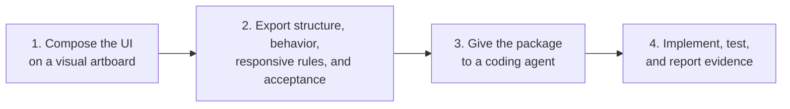

# AUB — UI Blueprint Agent

**Draw the interface. Export a UI contract. Let coding agents build and verify it.**

[](https://github.com/HenryLau1103/AUB/actions/workflows/ci.yml)
[](./LICENSE)
[](./schema/ui-blueprint.schema.json)
[](./package.json)

[繁體中文](./README-ZH.MD) · [Agent handoff guide](./docs/agent-handoff.md) · [Canonical example](./examples/dashboard.ui.json)


AUB is a visual UI specification tool for people who need to communicate a screen precisely to Codex, Claude Code, GitHub Copilot, or another coding agent. Build the screen on an artboard, declare behavior and acceptance criteria, then export a structured package the agent can implement without guessing from prose or screenshots alone.

> **Live demo:** [henrylau1103.github.io/AUB](https://henrylau1103.github.io/AUB/) — the editor runs entirely in your browser.

## How it works



1. **Compose visually** — start from one of 18 common application and website templates, or arrange registered components directly on the canvas.
2. **Export a contract** — AUB records semantic hierarchy, auto/freeform layout, exact viewport placement, interactions, design tokens, responsive rules, and acceptance criteria.
3. **Hand off to an agent** — the `.aub.zip` package tells the agent what to read, what to build, and how to prove the result.

## Who AUB is for

- Product designers and developers who need more precision than a screenshot or prose prompt.
- Teams using coding agents to implement dashboards, forms, content products, commerce flows, and application shells.
- Agent and tooling developers who need a schema-valid, testable UI interchange format.
- Teams converting existing Angular screens into reusable UI Blueprints.

## The problem AUB solves

Prompts such as "build a dashboard like Stripe" or "make this responsive like Notion" leave critical decisions unstated. A screenshot shows appearance but not component intent, interaction outcomes, breakpoints, accessibility requirements, or the acceptance bar.

AUB turns those decisions into an explicit contract:

- Registered semantic component types instead of anonymous rectangles.
- Hierarchy and layout rules instead of inferred grouping.
- Desktop, tablet, and mobile behavior instead of "make it responsive."
- Declared interactions and states instead of guessed behavior.
- Testable acceptance ids instead of subjective approval.

See [failure cases](./docs/failure-cases.md) for concrete examples.

## Local quick start

Requirements: Node.js 24+ and pnpm.

```bash
git clone https://github.com/HenryLau1103/AUB.git
cd AUB
pnpm install
(cd apps/editor && pnpm install && pnpm dev)
```

Open the local URL printed by Vite, normally `http://127.0.0.1:5173/`.

In the editor:

1. Choose a template.
2. Drag components from their top-center handle or add components from the palette.
3. Complete Goal, Layout, Interactions, Responsive, Acceptance, and Handoff.
4. Export the AI handoff package.

## Give a Blueprint to an agent

Export an `.aub.zip`, place it in the target code repository, and tell the agent:

```text
Read AGENT-README.md in this AUB handoff package.
Explain the package to me in my language, inspect this repository,
implement the Blueprint, run the relevant checks, and report every acceptance id with evidence.
```

Every handoff package contains:

```text
AGENT-README.md
AGENT-README.zh-Hant.md
<screen>.ui.json
<screen>.ui.md
<screen>.agent.md
<screen>.codex.md
implementation-report.template.json
implementation-report.schema.json
screenshots/
  desktop.png
  tablet.png
  mobile.png
manifest.json
```

`<screen>.ui.json` is the source of truth. Markdown and screenshots are supporting evidence. The agent must inspect the target repository's own instructions before editing and must not redesign or weaken acceptance criteria.

Read the full [Agent handoff guide](./docs/agent-handoff.md).

## Agent support

| Agent | Support | Entry point |
|---|---|---|
| Codex | Dedicated adapter | `<screen>.codex.md` and repository `AGENTS.md` |
| Claude Code | Dedicated adapter | Generate with `--adapter claude-code`; reads `CLAUDE.md` |
| GitHub Copilot | Dedicated adapter | Generate with `--adapter copilot`; reads `.github/copilot-instructions.md` + `AGENTS.md` |
| Other coding agents | Generic handoff | `AGENT-README.md` and `<screen>.agent.md` |

The core Blueprint is agent-neutral. Adapters change execution instructions, not schema, layout semantics, interactions, or acceptance criteria.

Generate a prompt directly:

```bash
pnpm prompt examples/dashboard.ui.json dashboard.agent.md --adapter generic --task implement
pnpm prompt examples/dashboard.ui.json dashboard.codex.md --adapter codex --task implement
pnpm prompt examples/dashboard.ui.json dashboard.claude.md --adapter claude-code --task review
pnpm prompt examples/dashboard.ui.json dashboard.copilot.md --adapter copilot --task implement
```

Supported tasks are `author`, `plan`, `implement`, and `review`.

## MCP server

Instead of copying files into the target repository, agents that speak the
[Model Context Protocol](https://modelcontextprotocol.io) can call AUB tools directly over
stdio: `list_blueprints`, `get_blueprint`, `validate_blueprint`, `export_prompt`, and
`submit_report`.

```bash
(cd apps/mcp-server && pnpm install && pnpm build)
node apps/mcp-server/dist/index.js /path/to/your/repo
```

Register it with Claude Code, Codex, or any MCP client. See
[`apps/mcp-server/README.md`](./apps/mcp-server/README.md) for configuration snippets. The
server wraps the same libraries as the CLI, so schema, layout semantics, interactions, and
acceptance criteria are unchanged.

## What the Blueprint describes

- A tree of registered semantic UI nodes.
- Auto layout with flex/grid contracts or freeform per-viewport placements.
- Component content, design tokens, bindings, states, and constraints.
- User interactions and observable outcomes.
- Responsive overrides for named viewports.
- At least five acceptance criteria spanning layout, interaction, responsive behavior, and accessibility.
- Optional provenance for imported source files and diagnostics.

Primary formats:

| Format | Use |
|---|---|
| `.ui.json` | Machine validation and source of truth |
| `.ui.yaml` | Human editing |
| `.ui.md` | Generated agent and reviewer context |
| `.ui.lock.json` | Frozen acceptance snapshot |
| `.aub.zip` | Complete agent handoff |

## Custom component types

The 62 core component types are curated and closed so every type has a meaning agents can resolve. Projects that need bespoke components declare **namespaced extension types** in an `aub.registry.json` at the project root, using a `team:component` namespace (e.g. `acme:insight_card`). They are validated, resolvable, and bundled into handoffs — never free-guessed.

```bash
# Auto-discovers aub.registry.json from the file's directory upward
pnpm validate examples/extensions/analytics-insights.ui.json

# Or point at a specific registry
pnpm validate path/to/screen.ui.json --registry ./aub.registry.json
```

See [custom component types](./docs/custom-components.md) and the worked example in [`examples/extensions/`](./examples/extensions/).

## Existing-screen and AI authoring workflows

Import an Angular HTML/SCSS/TS component bundle:

```bash
pnpm import:angular path/to/component-directory \
  --entry app-example \
  --output example.ui.json
```

Create a portable kit that teaches an AI to author valid AUB files:

```bash
pnpm authoring:kit aub-authoring-kit.zip
```

The kit includes the current schema, 62-component registry, canonical example, validation guide, and authoring prompt. See [Angular import](./docs/angular-import.md) and the [adapter interface](./docs/agent-adapter-interface.md).

## Validate and review

```bash
# Validate a Blueprint
pnpm validate examples/dashboard.ui.json

# Migrate v0.1/v0.2 to v0.3
pnpm migrate old.ui.json migrated.ui.json

# Compare Blueprint revisions
pnpm diff before.ui.json after.ui.json

# Create and verify an implementation report
pnpm report:init examples/dashboard.ui.json implementation-report.json
pnpm report:verify examples/dashboard.ui.json implementation-report.json
```

AUB includes deterministic agent-readability and browser-based implementation benchmarks. The current local reference checks cover hierarchy, geometry, layout mode, responsive overflow, interactions, accessibility states, screenshots, and report completeness.

See [agent readability](./benchmarks/agent-readability/README.md) and [implementation benchmark](./benchmarks/agent-implementation/README.md).

## Editor / IDE integration

Blueprint files are backed by the JSON Schema at [`schema/ui-blueprint.schema.json`](./schema/ui-blueprint.schema.json), so editors can validate and autocomplete them as you type.

- **VS Code:** this repo ships [`.vscode/settings.json`](./.vscode/settings.json), which maps `*.ui.json` and `*.ui.yaml` to the schema automatically. Install the recommended [YAML extension](https://marketplace.visualstudio.com/items?itemName=redhat.vscode-yaml) for `.ui.yaml` support.
- **Standalone files / other editors:** add a `$schema` key pointing at the schema, as the canonical examples do:

  ```json
  { "$schema": "../schema/ui-blueprint.schema.json", "version": "0.3.0" }
  ```

  For YAML, use the YAML language server directive:

  ```yaml
  # yaml-language-server: $schema=../schema/ui-blueprint.schema.json
  ```

The `$schema` key is optional and ignored by AUB tooling — it only drives editor validation.

## Project status

- Blueprint schema and semantic validation: implemented.
- WYSIWYG editor with freeform/auto layout, drag, resize, multi-select, zoom, localization, and templates: implemented.
- JSON, Markdown, screenshots, hashes, and `.aub.zip` handoff: implemented.
- Codex, Claude Code, and GitHub Copilot adapters: implemented.
- Angular import, personal templates, and AI authoring kit: implemented.
- Blueprint diff and implementation report verification: implemented.
- MCP server (stdio) exposing list/get/validate/export-prompt/submit-report tools: implemented.
- Multi-screen projects, YAML editing in the UI, and editor-side lock generation: backlog.

The current format version is `0.3.0`. See [schema versioning](./docs/schema-versioning.md) and [capability matrix](./docs/capability-matrix.md).

## Repository map

```text
schema/          JSON Schema, TypeScript types, component registry
scripts/         Validation, migration, export, import, diff, and report tools
examples/        Canonical JSON, YAML, Markdown, and lock fixtures
apps/editor/     Vite + React visual editor
apps/mcp-server/ Model Context Protocol server (stdio) exposing Blueprint tools
adapters/        Agent-specific prompt adapters
benchmarks/      Agent readability and implementation verification
docs/            Product decisions, guides, audits, and acceptance constraints
tests/           Node test suites for all contracts
```

The component registry is the single source of truth for component types. [`schema/registry/components.json`](./schema/registry/components.json) drives the schema enums and [`schema/types.ts`](./schema/types.ts); run `pnpm gen` after editing it and `pnpm gen:check` verifies they are in sync (CI enforces this).

## Contributing

Before opening a PR:

```bash
pnpm test
pnpm typecheck
pnpm gen:check
(cd apps/editor && pnpm typecheck)
(cd apps/editor && pnpm build)
pnpm validate examples/dashboard.ui.json
```

To add a **core** component type, edit `schema/registry/components.json` and run `pnpm gen` — the schema enums and TypeScript unions regenerate from it. To add a **project-specific** component without forking core, declare a namespaced extension type in `aub.registry.json` (see [custom component types](./docs/custom-components.md)).

Keep changes scoped, preserve round-trip integrity, and do not invent unregistered semantic component types — every type must be either a core type or a declared project extension.

## Deployment (GitHub Pages)

The landing page (`site/`) and the editor demo are published to
[henrylau1103.github.io/AUB](https://henrylau1103.github.io/AUB/) by
[`.github/workflows/pages.yml`](./.github/workflows/pages.yml) on every push to `main`. The
workflow builds the editor with `VITE_BASE=/AUB/editor/` and serves it under `/AUB/editor/`.

One-time repository setup (cannot be configured from code): **Settings → Pages → Build and
deployment → Source = GitHub Actions**.

Build the published site locally:

```bash
(cd apps/editor && VITE_BASE=/AUB/editor/ pnpm build)
mkdir -p _site/editor && cp -r site/. _site/ && cp -r apps/editor/dist/. _site/editor/
npx serve _site   # then open http://localhost:3000/AUB/  (paths assume the /AUB/ base)
```

## License

Licensed under the [Apache License 2.0](./LICENSE).
