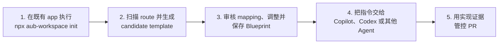

<p align="center">
  
</p>

# AUB — 让编码 Agent 安全修改既有 UI

**让 AI coding agent 安全修改既有产品界面，不乱生成组件、不破坏 responsive，并用证据管控 PR。**

[](https://github.com/HenryLau1103/AUB/actions/workflows/ci.yml)
[](./LICENSE)
[](./schema/ui-blueprint.schema.json)
[](./package.json)

[English](./README.md) · [繁體中文](./README.zh-Hant.md) · **简体中文** · [日本語](./README.ja.md) · [한국어](./README.ko.md)

[Workspace loop 指南](./docs/workspace-loop-user-manual.zh-Hans.md) · [10 分钟 demo](./docs/workspace-loop-10-minute-demo.md) · [AUB vs app builders](./docs/comparison-app-builders.md) · [No AUB vs AUB demo](./docs/demo-no-aub-vs-aub.md) · [GitHub agent workflow](./docs/github-agent-workflow.md) · [Security and data safety](./docs/security-and-data-safety.md) · [标准示例](./examples/dashboard.ui.json)


AUB 是给 coding agent 修改真实 app 的 local-first 工作台。它会扫描既有 route、转换成可编辑 Blueprint、让你审核自定义组件候选，再把可实现且可验证的契约交给 Codex、Claude Code、GitHub Copilot 或其他 Agent。

> **在线 Demo：** [henrylau1103.github.io/AUB/zh-hans](https://henrylau1103.github.io/AUB/zh-hans/) — 编辑器完全在浏览器中运行。

## 工作方式



1. **从你的 app 启动**：在既有项目根目录执行 `npx aub-workspace init`，再执行 `npx aub-workspace`，不需要 clone AUB。
2. **扫描并生成模板**：检测 routes、components、layout 线索与自定义组件候选。
3. **审核契约**：打开 candidate template，确认 mapping，调整 Blueprint。
4. **交给 Agent**：复制包含 active Blueprint、route、preview URL 与 MCP tools 的指令。
5. **用证据验收**：要求每个 node mapping 和 acceptance id 的证据，再用 GitHub Action 管控 PR。

## 既有项目最快开始

如果你已经有一个 app，想让 AUB 通过 MCP 扫描、生成模板、编辑并预览，请在那个 app 的根目录执行：

```bash
cd /path/to/your-existing-app
npx aub-workspace init
npx aub-workspace
```

这会启动本机 AUB MCP server、打开内置 editor，并自动把 editor 连接到你的 workspace。这条路径不需要先 clone AUB repo。

`init` 会安装 AUB CI 配置、`.aubignore`、`AGENTS.md`、GitHub issue templates、Copilot instructions 和 PR workflow。进入 editor 后按这条路径走：**扫描项目 → 生成模板 → 审核自定义组件候选 → 保存 Blueprint/session → 复制 Agent 指令**。把指令贴给 Copilot、Codex 或其他 coding agent，让它修改真实 app 并返回证据。

如果想先不用真实项目看完整安全流程，执行：

```bash
npx aub-workspace demo
```

这会创建一个合成 workspace，包含 `.aub/scan-report.json`、candidate template、Blueprint、一份会被 gate 拦下的低证据 report、一份可通过的 report，以及 fail/pass PR safety comment。这是最快看到“低证据 PR 被拦下，补足证据后进入审核”的方式。

## AUB 解决的问题

“做一个像 Stripe 的 dashboard”或“像 Notion 一样响应式”会遗漏组件意图、交互结果、breakpoint、无障碍要求和验收标准。AUB 把这些决策变成显式契约：

- 使用已注册的语义组件，而不是匿名矩形。
- 明确定义层级和 layout，不让 Agent 猜测分组关系。
- 定义桌面、平板和手机行为，而不只写“做成响应式”。
- 声明交互和状态，不让 Agent 自行补全行为。
- 使用可测试的 acceptance id，而不是主观审批。

## 本地快速开始

这条路径只适合开发 AUB 本身。要求：Node.js 24+ 与 pnpm。

```bash
git clone https://github.com/HenryLau1103/AUB.git
cd AUB
pnpm install
(cd apps/editor && pnpm install && pnpm dev)
```

打开 Vite 输出的地址，通常是 `http://127.0.0.1:5173/`。

## 交给编码 Agent

从编辑器导出 `.aub.zip`，放入目标代码仓库，然后要求 Agent：

```text
读取 AUB 交付包中的 AGENT-README.md。
用我的语言说明交付内容，检查当前仓库，
实现 Blueprint、运行相关检查，并逐项报告每个 acceptance id 的证据。
```

交付包包含 Blueprint JSON、派生 Markdown、通用与 Codex prompt、实现报告 schema、viewport 截图和 SHA-256 manifest。`<screen>.ui.json` 始终是唯一事实来源。

## Agent 支持

| Agent | 支持方式 | 入口 |
|---|---|---|
| Codex | 专用 adapter | `<screen>.codex.md` 与仓库 `AGENTS.md` |
| Claude Code | 专用 adapter | `--adapter claude-code`，读取 `CLAUDE.md` |
| GitHub Copilot | 专用 adapter | `--adapter copilot`，读取 Copilot instructions 与 `AGENTS.md` |
| 其他编码 Agent | 通用交付 | `AGENT-README.md` 与 `<screen>.agent.md` |

Adapter 只调整执行说明，不会修改 schema、layout、interaction 或 acceptance。

## MCP server

23 个 MCP 工具通过 stdio 或 Streamable HTTP 提供 Blueprint／project 查询、Figma／Penpot bridge 导入、验证后写入、handoff 打包、验证、规格补全、组件解析、prompt、diff、migration、lock、workspace session、项目扫描、模板生成、自定义组件候选审核和 implementation report。

```bash
(cd apps/mcp-server && pnpm install && pnpm build)
node apps/mcp-server/dist/index.js /path/to/your/repo

# Streamable HTTP
node apps/mcp-server/dist/http.js --workspace /path/to/your/repo --port 3100
```

既有项目可以启动 `aub-mcp-http`，让 AUB editor 连接 `http://127.0.0.1:3100/mcp`。Editor 可直接加载／保存 workspace 中的 Blueprint，更新 `.aub/session.json`，读取 `.aub/templates/*.aub.template.json`，审核 `.aub/component-candidates.json`，并预览真实 dev server route。Scanner 产出的自定义组件永远先进入候选文件，用户确认后才写入正式 `aub.registry.json`。

完整使用流程请看 [AUB Workspace Loop 操作手册](./docs/workspace-loop-user-manual.zh-Hans.md)。配置示例见 [`apps/mcp-server/README.md`](./apps/mcp-server/README.md)。

## Blueprint 契约

主要格式：

| 格式 | 用途 |
|---|---|
| `.ui.json` | 机器验证与唯一事实来源 |
| `.ui.yaml` | 人工编辑 |
| `.ui.md` | 自动生成的 Agent／reviewer 上下文 |
| `.ui.lock.json` | 冻结的验收快照 |
| `.aub.zip` | 完整 Agent 交付包 |

每个 screen 包含：

- 已注册语义 UI 节点树。
- flex/grid 自动布局或按 viewport 声明的自由布局。
- 内容、design token、binding、状态和限制。
- 用户交互与可观察结果。
- 响应式覆盖规则。
- 至少五项验收条件，覆盖 layout、interaction、responsive 和 accessibility。

## 自定义生产组件

62 个核心组件类型是封闭且可解析的。项目专属组件通过根目录的 `aub.registry.json` 声明 namespaced 类型，例如 `acme:insight_card`。`implementations` 可指定正式 module、export、source、Storybook 和 props mapping。

```bash
pnpm validate examples/extensions/analytics-insights.ui.json
pnpm validate path/to/screen.ui.json --registry ./aub.registry.json
```

Agent 可先调用 MCP `resolve_component`，再复用实际生产组件。

## 导入与生成

```bash
# Angular HTML／SCSS／TS
pnpm import:angular path/to/component-directory \
  --entry app-example \
  --output example.ui.json

# Figma／Penpot Design Bridge
pnpm import:design -- \
  examples/design-bridge/figma-hero.aub.bridge.json \
  --output marketing-hero.ui.json

# AI authoring kit
pnpm authoring:kit aub-authoring-kit.zip
```

Design Bridge 要求显式语义和完整 node mapping，不会根据图层名称猜测组件含义。

## 验证、差异和报告

```bash
pnpm validate examples/dashboard.ui.json
pnpm migrate old.ui.json migrated.ui.json
pnpm diff before.ui.json after.ui.json
pnpm report:init examples/dashboard.ui.json implementation-report.json
pnpm report:verify examples/dashboard.ui.json implementation-report.json
pnpm report:capture -- --workspace /path/to/app --blueprint screens/settings.ui.json --url http://localhost:3000/settings
pnpm report:verify screens/settings.ui.json .aub/reports/workspace.settings.implementation-report.json --require-evidence
pnpm report:score screens/settings.ui.json .aub/reports/workspace.settings.implementation-report.json
pnpm report:playwright -- --workspace /path/to/app --blueprint screens/settings.ui.json --url http://localhost:3000/settings --output tests/aub-ui.spec.ts
```

补全缺少的 interaction、responsive 和 acceptance：

```bash
pnpm scaffold path/to/screen.ui.json --write
pnpm scaffold path/to/screen.ui.json \
  --sections acceptance,responsive \
  --language zh-Hant \
  --write
```

## 多页面项目

`*.aub.project.json` 通过路径引用多个独立 Blueprint，并声明入口页面、共享 design system 和导航图。

```bash
pnpm project validate examples/project/app.aub.project.json
pnpm project init app.aub.project.json dashboard.ui.json settings.ui.json
pnpm project export-md examples/project/app.aub.project.json ./out
```

编辑器支持页面切换、新增／删除／重命名、入口设置、导航编辑和项目 ZIP 导出。

## Pull Request 验收门禁

```yaml
- uses: HenryLau1103/AUB@main
  with:
    config: .aub/ci.json
    require-reports: "true"
    require-evidence: "false"
```

它会验证 Blueprint、project、extension registry、node mapping、acceptance 证据和 unresolved work。本地执行：

```bash
pnpm ci:verify -- --workspace /path/to/target/repo --require-reports
pnpm ci:verify -- --workspace /path/to/target/repo --require-reports --require-evidence
```

## 项目状态

- 产品／package release：`0.4.0`，重点是 workspace safety demo、PR evidence review、scanner trust breakdown 与 demo mode 分离。Blueprint 格式仍维持 `0.3.0`。
- Blueprint schema、语义验证、migration、diff、lock：已实现。
- WYSIWYG 编辑器、18 个模板、多页面项目和五语 landing page：已实现。
- Angular 与 Figma／Penpot bridge 导入：已实现。
- Codex、Claude Code、GitHub Copilot adapter：已实现。
- stdio／HTTP MCP server，23 个工具：已实现。
- 一键 workspace 初始化（`npx aub-workspace init`）：CI 配置、`.aubignore`、`AGENTS.md`、issue templates、Copilot instructions 和 PR workflow：已实现。
- Workspace-connected editor loop、本机 MCP HTTP、session、项目扫描模板、自定义组件候选审核、直接保存 Blueprint 与实现预览：已实现。
- Implementation evidence capture：viewport 截图、DOM query、overflow 与 report evidence 验证：已实现。
- 生产组件 mapping、implementation report、GitHub Action、PR Safety Score comment 与 evidence matrix：已实现。
- UI 内 YAML 编辑与 editor 内 lock 生成：待办。

当前格式版本为 `0.3.0`。

## 合并前检查

```bash
pnpm test
pnpm typecheck
pnpm gen:check
pnpm site:locales:check
(cd apps/editor && pnpm typecheck && pnpm build)
(cd apps/mcp-server && pnpm typecheck && pnpm build && pnpm test)
pnpm validate examples/dashboard.ui.json
pnpm ci:verify -- --config examples/ci/aub.ci.json
```

## GitHub Pages

英文位于 `/AUB/`，繁中、简中、日文、韩文分别位于 `/zh-hant/`、`/zh-hans/`、`/ja/`、`/ko/`，编辑器位于 `/editor/`。页面由 `scripts/generate-site-locales.mjs` 从同一份 locale 数据生成。

## 许可证

使用 [Apache License 2.0](./LICENSE)。
