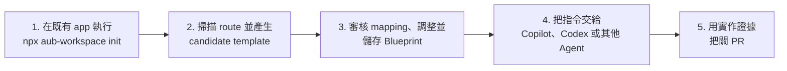

<p align="center">
  
</p>

# AUB — 讓編碼 Agent 安全修改既有 UI

**讓 AI coding agent 安全修改既有產品畫面，不亂生元件、不破壞 responsive，並以證據把關 PR。**

[](https://github.com/HenryLau1103/AUB/actions/workflows/ci.yml)
[](./LICENSE)
[](./schema/ui-blueprint.schema.json)
[](./package.json)

[English](./README.md) · **繁體中文** · [简体中文](./README.zh-Hans.md) · [日本語](./README.ja.md) · [한국어](./README.ko.md)

> 本檔已與目前主版 README 的章節結構核對，僅保留正體中文譯文版本。

[Workspace loop 指南](./docs/workspace-loop-user-manual.zh-Hant.md) · [10 分鐘 demo](./docs/workspace-loop-10-minute-demo.md) · [Agent 交付指南](./docs/agent-handoff.zh-Hant.md) · [GitHub agent workflow](./docs/github-agent-workflow.md) · [標準範例](./examples/dashboard.ui.json)


AUB 是給 coding agent 修改真實 app 的 local-first 工作台。它會掃描既有 route、轉成可編輯 Blueprint、讓你審核自訂元件候選，再把可實作且可驗證的合約交給 Codex、Claude Code、GitHub Copilot 或其他 Agent。

> **線上 Demo：**[henrylau1103.github.io/AUB/zh-hant](https://henrylau1103.github.io/AUB/zh-hant/) — 編輯器完全在你的瀏覽器中執行。

## 運作方式



1. **從你的 app 啟動**：在既有專案根目錄執行 `npx aub-workspace init`，再執行 `npx aub-workspace`，不需要 clone AUB。
2. **掃描並產範本**：偵測 routes、components、layout 線索與自訂元件候選。
3. **審核合約**：打開 candidate template，確認 mapping，調整 Blueprint。
4. **交給 Agent**：複製包含 active Blueprint、route、preview URL 與 MCP tools 的指令。
5. **以證據驗收**：要求每個 node mapping 與 acceptance id 的證據，再用 GitHub Action 對 PR 把關。

## 適合誰使用

- 希望 coding agent 修改既有 app 畫面時不偏離產品意圖的產品設計師與開發者。
- 使用編碼 Agent 在真實 repository 裡實作儀表板、表單、內容產品、商務流程與應用框架的團隊。
- 需要 schema 驗證與可測試 UI 交換格式的 Agent 或工具開發者。
- 希望 Agent 重用正式元件，而不是建立相似替代品的 design-system 團隊。
- 希望把既有 Angular 畫面轉成可重用 UI Blueprint 的團隊。

## 既有專案最快開始

如果你已經有一個 app，想讓 AUB 透過 MCP 掃描、產生範本、編輯並預覽，請在那個 app 的根目錄執行：

```bash
cd /path/to/your-existing-app
npx aub-workspace init
npx aub-workspace
```

這會啟動本機 AUB MCP server、開啟內建 editor，並自動把 editor 連到你的 workspace。這條路徑不需要先 clone AUB repo。

`init` 會安裝 AUB CI 設定、GitHub issue templates、Copilot instructions 與 PR workflow。進入 editor 後照這條路徑走：**掃描專案 → 產生範本 → 審核自訂元件候選 → 儲存 Blueprint/session → 複製 Agent 指令**。把指令貼給 Copilot、Codex 或其他 coding agent，讓它修改真實 app 並回報證據。

## AUB 解決什麼問題

「做一個像 Stripe 的 dashboard」或「做成像 Notion 一樣響應式」這類提示，會遺漏許多關鍵決策。截圖能表達外觀，卻無法交代元件意圖、互動結果、breakpoint、無障礙需求或驗收標準。

AUB 把這些決策變成明確合約：

- 使用已註冊的語意元件，不是匿名矩形。
- 明確定義階層與 layout，不讓 Agent 猜群組關係。
- 定義桌面、平板與手機行為，不只寫「要響應式」。
- 宣告互動與狀態，不讓 Agent 自行補劇情。
- 使用可測試的 acceptance id，不靠主觀感覺放行。

具體案例請看[純文字需求的失敗案例](./docs/failure-cases.md)。

## 本機快速開始

這條路徑只適合開發 AUB 本身。需求：Node.js 24+ 與 pnpm。

```bash
git clone https://github.com/HenryLau1103/AUB.git
cd AUB
pnpm install
(cd apps/editor && pnpm install && pnpm dev)
```

開啟 Vite 顯示的本機網址，通常是 `http://127.0.0.1:5173/`。

進入編輯器後：

1. 選擇範本。
2. 從元件上方中央把手拖曳，或從元件面板新增元件。
3. 完成畫面目標、畫面佈局、互動行為、響應式、驗收條件與 AI 交付。
4. 匯出 AI 交付包。

## 把 Blueprint 交給 Agent

匯出 `.aub.zip`，放進目標程式碼 repository，然後對 Agent 說：

```text
讀取這個 AUB 交付包中的 AGENT-README.md。
用我的語言向我說明交付包內容，檢查目前 repository，
實作 Blueprint、執行相關檢查，並逐項回報每個 acceptance id 的證據。
```

每個交付包都包含：

```text
AGENT-README.md
AGENT-README.zh-Hant.md
<screen>.ui.json
<screen>.ui.md
<screen>.agent.md
<screen>.codex.md
implementation-report.template.json
implementation-report.schema.json
screenshots/
  desktop.png
  tablet.png
  mobile.png
manifest.json
```

`<screen>.ui.json` 是唯一真實來源；Markdown 與截圖是輔助證據。Agent 在修改檔案前必須先讀取目標 repository 的規則，不得自行重新設計或降低驗收條件。

請閱讀完整的 [Agent 交付指南](./docs/agent-handoff.zh-Hant.md)。

## Agent 支援

| Agent | 支援方式 | 入口 |
|---|---|---|
| Codex | 專用 adapter | `<screen>.codex.md` 與 repository 的 `AGENTS.md` |
| Claude Code | 專用 adapter | 使用 `--adapter claude-code` 產生；讀取 `CLAUDE.md` |
| GitHub Copilot | 專用 adapter | 使用 `--adapter copilot` 產生；讀取 `.github/copilot-instructions.md` 與 `AGENTS.md` |
| 其他編碼 Agent | 通用交付 | `AGENT-README.md` 與 `<screen>.agent.md` |

核心 Blueprint 與 Agent 平台無關。Adapter 只調整執行指示，不會改變 schema、layout 語意、互動或驗收條件。

直接產生任務提示：

```bash
pnpm prompt examples/dashboard.ui.json dashboard.agent.md --adapter generic --task implement
pnpm prompt examples/dashboard.ui.json dashboard.codex.md --adapter codex --task implement
pnpm prompt examples/dashboard.ui.json dashboard.claude.md --adapter claude-code --task review
pnpm prompt examples/dashboard.ui.json dashboard.copilot.md --adapter copilot --task implement
```

支援的任務為 `author`、`plan`、`implement` 與 `review`。

## MCP server

支援 [Model Context Protocol](https://modelcontextprotocol.io) 的 Agent 可以直接透過 stdio 或 Streamable HTTP 呼叫 AUB 工具，不需要把檔案複製進目標 repository。23 個工具涵蓋 Blueprint／project 探索、Figma／Penpot Design Bridge 匯入、驗證後寫入、handoff 打包、規格補全、元件解析、prompt、diff、migration、lock、workspace session、專案掃描、範本生成、自訂元件候選審核與 implementation report。

```bash
(cd apps/mcp-server && pnpm install && pnpm build)
node apps/mcp-server/dist/index.js /path/to/your/repo
# 或透過 Streamable HTTP 提供相同工具
node apps/mcp-server/dist/http.js --workspace /path/to/your/repo --port 3100
```

在 Claude Code、Codex 或任何 MCP client 中註冊後即可使用。設定片段與說明請看 [`apps/mcp-server/README.md`](./apps/mcp-server/README.md)。Server 包裝的是與 CLI 相同的函式庫，schema、layout 語意、互動與驗收條件完全不變。

既有專案可啟動 `aub-mcp-http` 後，讓 AUB editor 連到 `http://127.0.0.1:3100/mcp`。Editor 可直接載入／儲存 workspace 裡的 Blueprint、更新 `.aub/session.json`、讀取 `.aub/templates/*.aub.template.json`、審核 `.aub/component-candidates.json`，並以 iframe 預覽真實 dev server route。Scanner 產生的自訂元件永遠先進候選檔，使用者核准後才會寫入正式 `aub.registry.json`。

完整使用流程請看 [AUB Workspace Loop 操作步驟手冊](./docs/workspace-loop-user-manual.zh-Hant.md)。

## Blueprint 描述的內容

- 由已註冊語意 UI 節點組成的樹狀結構。
- 使用 flex/grid 合約的自動佈局，或各 viewport 的自由佈局位置。
- 元件內容、design token、binding、狀態與限制。
- 使用者互動與可觀察結果。
- 針對命名 viewport 的響應式覆寫規則。
- 至少五項驗收條件，涵蓋 layout、interaction、responsive 與 accessibility。
- 既有程式碼匯入時可選擇保留來源與診斷資料。

主要格式：

| 格式 | 用途 |
|---|---|
| `.ui.json` | 機器驗證與唯一真實來源 |
| `.ui.yaml` | 人工編輯 |
| `.ui.md` | 自動生成的 Agent 與 reviewer 上下文 |
| `.ui.lock.json` | 凍結的驗收快照 |
| `.aub.zip` | 完整 Agent 交付包 |

## 自訂元件類型

62 個核心元件類型是精選且封閉的，確保每個類型都有 Agent 能解析的明確語意。需要客製元件的專案可在專案根目錄的 `aub.registry.json` 中宣告**具命名空間的擴充類型**，採用 `team:component` 命名（例如 `acme:insight_card`）。這些類型會被驗證、可被解析，並打包進交付包——絕不靠猜測。`implementations` 還能指定正式元件的 module、export、source、Storybook 與 props mapping，讓 Agent 優先重用既有元件。

```bash
# 從檔案所在目錄向上自動探索 aub.registry.json
pnpm validate examples/extensions/analytics-insights.ui.json

# 或指定特定的 registry
pnpm validate path/to/screen.ui.json --registry ./aub.registry.json
```

詳見 [自訂元件類型](./docs/custom-components.md) 與 [`examples/extensions/`](./examples/extensions/) 的完整範例。

## 既有畫面與 AI 生成流程

匯入 Angular HTML／SCSS／TS 元件檔案組：

```bash
pnpm import:angular path/to/component-directory \
  --entry app-example \
  --output example.ui.json
```

匯入已明確標註語意與節點對應的 Figma／Penpot Design Bridge：

```bash
pnpm import:design -- \
  examples/design-bridge/figma-hero.aub.bridge.json \
  --output marketing-hero.ui.json
```

建立可攜式工具包，教 AI 產生有效的 AUB 檔案：

```bash
pnpm authoring:kit aub-authoring-kit.zip
```

工具包包含目前 schema、62 種元件 registry、標準範例、驗證指南與生成提示。詳細內容請看 [Angular 匯入](./docs/angular-import.md)、[Figma／Penpot Design Bridge](./docs/design-tool-bridge.md) 與 [adapter 介面](./docs/agent-adapter-interface.md)。

## 驗證與審查

```bash
# 驗證 Blueprint
pnpm validate examples/dashboard.ui.json

# 將 v0.1／v0.2 升級為 v0.3
pnpm migrate old.ui.json migrated.ui.json

# 比較兩版 Blueprint
pnpm diff before.ui.json after.ui.json

# 建立並驗證 implementation report
pnpm report:init examples/dashboard.ui.json implementation-report.json
pnpm report:verify examples/dashboard.ui.json implementation-report.json

# 擷取 preview 截圖、overflow 檢查與 implementation evidence
pnpm report:capture -- --workspace /path/to/app --blueprint screens/settings.ui.json --url http://localhost:3000/settings
pnpm report:verify screens/settings.ui.json .aub/reports/workspace.settings.implementation-report.json --require-evidence
```

### 自動補全規格段落

從既有的節點樹與 viewport，確定性地推導出最容易留空的規格段落——
`interactions`、`responsive` 與 `acceptance`。補全是**非破壞性**的：只會附加缺少的項目
（並把 acceptance 補到必備的五條，涵蓋 layout／interaction／responsive／a11y），
不會覆寫或重排你既有的內容。執行第二次不會有任何變動。

```bash
# 預覽輸出到 stdout
pnpm scaffold examples/dashboard.ui.json --stdout

# 將補全結果寫回檔案
pnpm scaffold path/to/screen.ui.json --write

# 只補全特定段落，並本地化產生的敘述
pnpm scaffold path/to/screen.ui.json --sections acceptance,responsive --language zh-Hant --write
```

在編輯器中，每個規格清單（Interactions、Responsive、Acceptance）都有一個
**從佈局建議**按鈕，執行的是相同邏輯。透過 MCP 的 Agent 可呼叫 `scaffold_blueprint`
工具，在交付實作前先取得規格完整的 blueprint。

### 多畫面專案

單一 `.ui.json` 是一個畫面。若要把多個畫面組成可導覽的產品，AUB 採用參照式的
**專案**文件（`*.aub.project.json`），以路徑列出成員 Blueprint 檔案、宣告導覽圖、
指定起始畫面，並可選擇性攜帶共用 design system。成員畫面仍是完全有效的獨立
Blueprint，且 Blueprint schema 維持不變。

```bash
# 驗證專案（schema + 專案語意 + 每個成員畫面）
pnpm project validate examples/project/app.aub.project.json

# 將既有的單一畫面包裝成新專案（entry = 第一個）
pnpm project init app.aub.project.json dashboard.ui.json settings.ui.json

# 產生專案總覽 .md 與各畫面的 agent context
pnpm project export-md examples/project/app.aub.project.json ./out
```

編輯器可開啟專案、切換畫面、新增／移除／重新命名畫面、設定起始畫面、編輯導覽圖，
並將整個專案另存為 `.zip`。透過 MCP 的 Agent 可使用 `list_projects`／`get_project`／
`validate_project`。詳見[多畫面專案](./docs/multi-screen.md)。

### 畫布解析度

每個 viewport 的解析度都可在編輯器中設定：可選擇常用預設值（1440×900、1920×1080、
iPad、iPhone、Android…）或自由輸入任意寬×高（夾擠在 schema 的 320–7680 × 320–4320
範圍內）。解析度存放在 Blueprint 的 `viewports`，會隨檔案一起保存。

AUB 內建確定性的 Agent 可讀性評分，以及以瀏覽器執行的實作驗證。現有本機參考檢查涵蓋階層、幾何、layout mode、響應式 overflow、互動、無障礙狀態、截圖與報告完整性。

請參考 [Agent 可讀性測試](./benchmarks/agent-readability/README.md)與[實作基準測試](./benchmarks/agent-implementation/README.md)。

### Pull Request 驗收閘門

在實作 repository 中加入 `.aub/ci.json`，再使用內建 GitHub Action：

```yaml
- uses: HenryLau1103/AUB@main
  with:
    config: .aub/ci.json
    require-reports: "true"
    require-evidence: "false"
```

這個 check 會驗證 Blueprint、project、extension registry、node mapping、acceptance
證據與 unresolved work。`require-evidence` 第一版預設為 `false`；需要強制 screenshot、DOM、overflow、component reuse 等機器可檢查證據時可改為 `true`。本機可執行：

```bash
pnpm ci:verify -- --workspace /path/to/target/repo --require-reports
pnpm ci:verify -- --workspace /path/to/target/repo --require-reports --require-evidence
```

完整說明請看 [GitHub CI acceptance gate](./docs/github-ci.md)。

## 編輯器 / IDE 整合

Blueprint 檔案以 [`schema/ui-blueprint.schema.json`](./schema/ui-blueprint.schema.json) 為依據，因此編輯器可在你輸入時即時驗證並自動補全。

- **VS Code：**本 repo 內含 [`.vscode/settings.json`](./.vscode/settings.json)，會自動把 `*.ui.json` 與 `*.ui.yaml` 對應到 schema。請安裝建議的 [YAML 擴充套件](https://marketplace.visualstudio.com/items?itemName=redhat.vscode-yaml) 以支援 `.ui.yaml`。
- **獨立檔案／其他編輯器：**比照標準範例，加入指向 schema 的 `$schema` 欄位：

  ```json
  { "$schema": "../schema/ui-blueprint.schema.json", "version": "0.3.0" }
  ```

  YAML 則使用 YAML language server 指示行：

  ```yaml
  # yaml-language-server: $schema=../schema/ui-blueprint.schema.json
  ```

`$schema` 欄位為選填，AUB 工具會忽略它——它只用來驅動編輯器驗證。

## 專案狀態

- Blueprint schema 與語意驗證：已實作。
- WYSIWYG 編輯器，自由／自動佈局、拖曳、縮放、多選、畫板縮放、本地化與範本：已實作。
- JSON、Markdown、截圖、雜湊與 `.aub.zip` 交付：已實作。
- Codex、Claude Code 與 GitHub Copilot adapter：已實作。
- Angular 匯入、個人範本與 AI 生成工具包：已實作。
- Blueprint diff 與 implementation report 驗證：已實作。
- MCP server（stdio + Streamable HTTP），提供 23 個工具，包含 Design Bridge、驗證後寫入、handoff 打包、Blueprint／project／component／diff／migrate／lock／workspace session／專案掃描／範本生成／候選審核／report：已實作。
- 一鍵 workspace 初始化（`npx aub-workspace init`）：CI 設定、issue templates、Copilot instructions 與 PR workflow：已實作。
- Workspace-connected editor loop：本機 MCP HTTP、session state、scanner 產生的範本、自訂元件候選審核、直接儲存 Blueprint 與實作預覽：已實作。
- Implementation evidence capture：viewport 截圖、DOM query、overflow 與 report evidence 驗證：已實作。
- `aub.registry.json` production component mapping：已實作。
- GitHub Action 與本機 CI 驗收器：已實作。
- 多畫面專案（參照式 `.aub.project.json`、CLI、MCP 工具、編輯器畫面切換器與導覽）：已實作。
- 可設定的畫布解析度（預設值 + 自訂寬高）：已實作。
- 英文、繁中、簡中、日文、韓文 GitHub Pages 與 README：已實作。
- UI 內 YAML 編輯與 editor 內 lock 產生：待辦。

目前格式版本為 `0.3.0`。請看 [schema 版本管理](./docs/schema-versioning.md)與[能力矩陣](./docs/capability-matrix.md)。

## Repository 結構

```text
schema/          JSON Schema、TypeScript 型別、元件 registry 與 CI 合約
scripts/         驗證、遷移、匯出、匯入、diff 與報告工具
examples/        標準 JSON、YAML、Markdown 與 lock 範例
apps/editor/     Vite + React 視覺編輯器
apps/mcp-server/ Model Context Protocol server（stdio + Streamable HTTP）
adapters/        各 Agent 專用提示 adapter
benchmarks/      Agent 可讀性與實作驗證
docs/            產品決策、指南、審查與驗收限制
tests/           所有合約的 Node 測試
```

元件 registry 是元件類型的唯一真實來源。[`schema/registry/components.json`](./schema/registry/components.json) 會驅動 schema 的 enum 與 [`schema/types.ts`](./schema/types.ts)；編輯後請執行 `pnpm gen`，並以 `pnpm gen:check` 驗證同步（CI 會強制檢查）。

## 貢獻方式

送出 PR 前：

```bash
pnpm test
pnpm typecheck
pnpm gen:check
(cd apps/editor && pnpm typecheck)
(cd apps/editor && pnpm build)
(cd apps/mcp-server && pnpm typecheck && pnpm build)
pnpm validate examples/dashboard.ui.json
pnpm ci:verify -- --config examples/ci/aub.ci.json
```

新增**核心**元件類型時，請編輯 `schema/registry/components.json` 並執行 `pnpm gen`，schema enum 與 TypeScript 型別會自動重新產生。若要新增**專案專屬**元件而不分叉核心，請在 `aub.registry.json` 中宣告具命名空間的擴充類型（見 [自訂元件類型](./docs/custom-components.md)）。

修改範圍應保持精簡、維持 round-trip 完整性，並且不得自創未註冊的語意元件類型——每個類型都必須是核心類型或已宣告的專案擴充類型。

## 部署（GitHub Pages）

landing 頁（`site/`）與編輯器 demo 由 [`.github/workflows/pages.yml`](./.github/workflows/pages.yml) 在每次 push 到 `main` 時發布到 [henrylau1103.github.io/AUB](https://henrylau1103.github.io/AUB/)。工作流程會以 `VITE_BASE=/AUB/editor/` 建置編輯器，並掛載在 `/AUB/editor/`。

一次性 repository 設定（無法由程式碼設定）：**Settings → Pages → Build and deployment → Source = GitHub Actions**。

英文位於 `/AUB/`；繁中、簡中、日文、韓文分別位於 `/zh-hant/`、`/zh-hans/`、
`/ja/`、`/ko/`。五個 landing page 都由 `scripts/generate-site-locales.mjs` 產生；
修改多語文案後請執行 `pnpm site:locales`。

在本機建置發布內容：

```bash
pnpm site:locales:check
(cd apps/editor && VITE_BASE=/AUB/editor/ pnpm build)
mkdir -p _site/editor && cp -r site/. _site/ && cp -r apps/editor/dist/. _site/editor/
npx serve _site   # 開啟 http://localhost:3000/AUB/（路徑以 /AUB/ base 為準）
```

## 授權

本專案採用 [Apache License 2.0](./LICENSE)。
