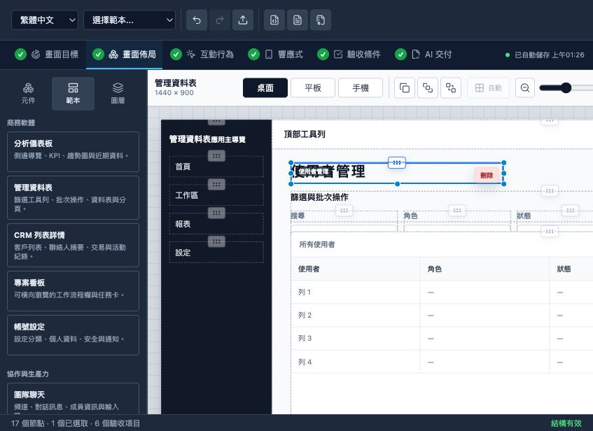
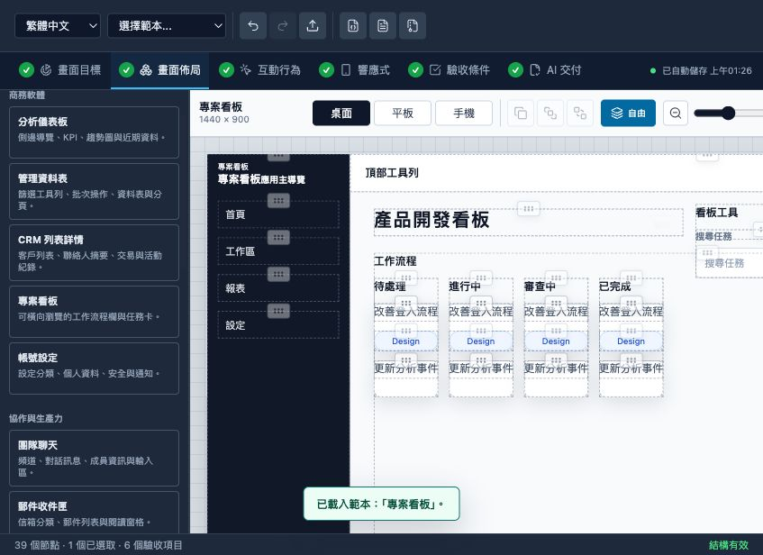
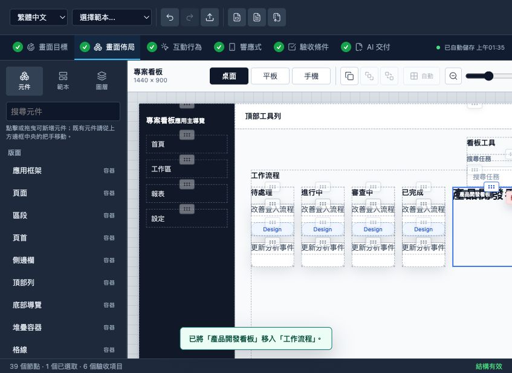
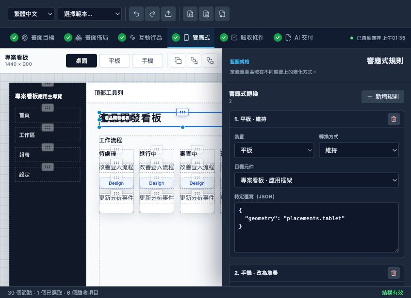
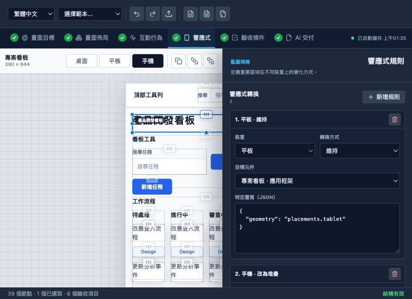
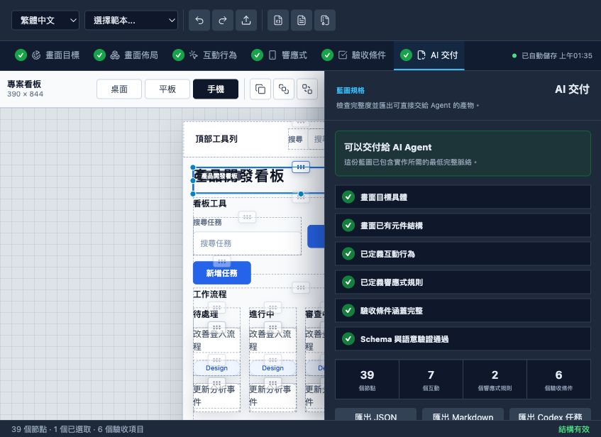
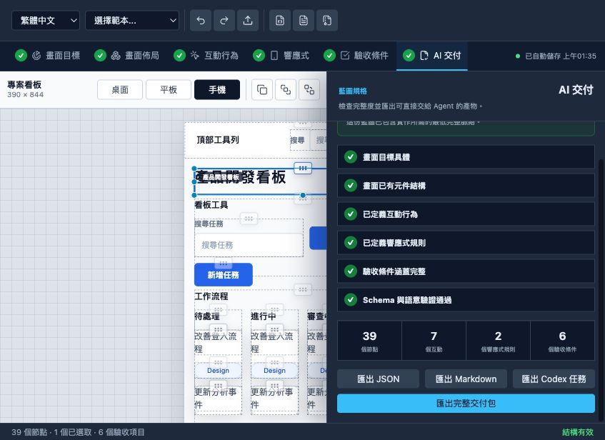
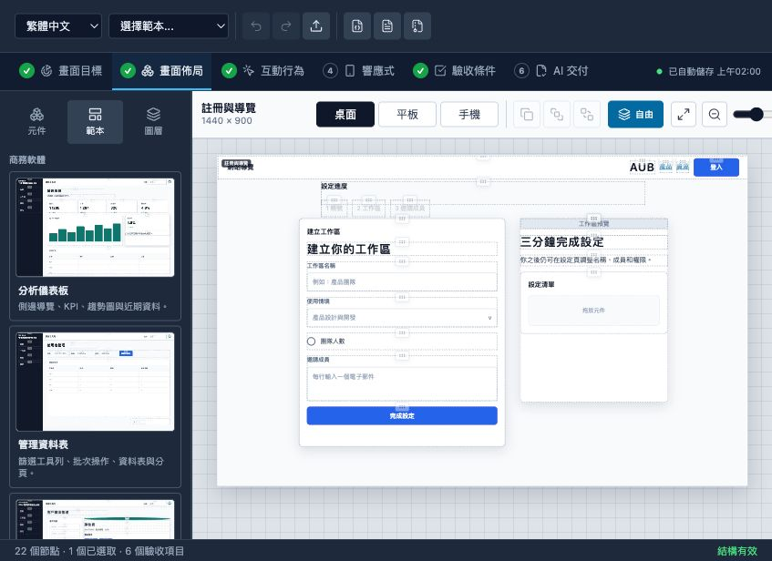
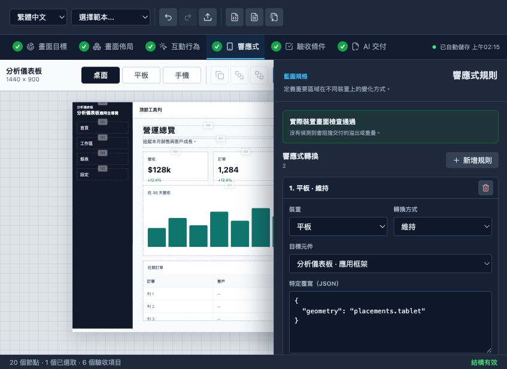

# AUB Editor Product Review

Date: 2026-06-10
Surface: `http://127.0.0.1:5174/`
Viewport used for review: 847 x 616

## Executive Summary

This iteration has moved beyond a basic prototype. It now has a coherent product
shape: a visual editor, 18 grouped templates, a six-stage blueprint workflow,
freeform geometry, responsive rules, acceptance criteria, and an AI handoff
package.

The strongest part is the machine-readable handoff. The weakest part is still
the core canvas interaction. A normal drag can silently become a reparent
operation when the pointer crosses another container. This makes freeform layout
unpredictable and conflicts with the draw.io-like expectation.

Overall assessment:

- Product direction: strong
- Template coverage: strong
- Canvas predictability: weak
- Responsive visual fidelity: weak
- AI data extraction precision: strong
- AI implementation-readiness signal: medium

## Review Steps

### Step 1 - Current editor canvas

Health: Mostly usable

Strengths:

- The canvas now reads as a UI composition rather than a node graph.
- Selection, resize handles, delete controls, zoom, viewport switching, and
  toolbar actions are visible.
- Traditional Chinese coverage is broad and consistent.

Issues:

- At this viewport, the palette and canvas compete heavily for width.
- Selection handles and the inline delete action overlap dense content.
- There is no obvious fit-to-selection or fit-artboard action.

### Step 2 - Template browser

Health: Good coverage, weak visual onboarding

Strengths:

- Eighteen templates cover business software, productivity, commerce, and
  growth use cases.
- Group names and one-line descriptions explain the intended structure.

Issues:

- Text-only cards do not let users compare layouts before replacing the canvas.
- Loading a template immediately replaces the working composition.
- The narrow browser forces substantial scrolling and leaves no room for a
  preview thumbnail.

### Step 3 - Project kanban template

Health: Structurally useful, visually cramped

Strengths:

- The template demonstrates app shell, navigation, toolbar, board, columns, and
  tasks as a complete hierarchy.
- A visible toast confirms that the template loaded.

Issues:

- Four board columns are compressed into unreadable cards.
- The right toolbar extends beyond the visible artboard.
- Large unused white space coexists with overcrowded content.
- A newly loaded template should automatically fit the relevant content.

### Step 4 - Freeform drag

Health: Failing the main product promise

Observed behavior:

- Dragging the title from its dedicated handle across the board reparented it
  into the workflow container.
- The title lost its original freeform geometry and moved partly outside the
  visible canvas.
- A toast explained the result only after the destructive structural change.

Cause:

- During every pointer move, the editor searches for a container under the
  pointer.
- On pointer release, a different detected container takes priority over moving
  the node within its current parent.

Recommendation:

- Normal handle drag must only move within the current parent.
- Reparenting should require an explicit container drop zone, a modifier key, or
  a separate hierarchy operation.
- Show different visual states for "move" and "move into container".

### Step 5 - Responsive workflow

Health: Clear editor, insufficient validation

Strengths:

- Responsive rules are edited in a dedicated workflow step.
- Device, rule, target, and JSON overrides are explicit.

Issues:

- The rule editor does not explain which visible layout changes the selected
  rule currently causes.
- A rule can exist and mark the step complete without proving that the viewport
  is usable.

### Step 6 - Mobile preview

Health: Failing visual fidelity

Issues:

- The title overlaps other content.
- Toolbar controls and board columns overflow horizontally.
- Desktop-sized information density remains in the mobile composition.
- The responsive step is marked complete despite these visible failures.

Recommendation:

- Run overflow and overlap checks for every declared viewport.
- Block AI handoff when major nodes exceed their viewport or overlap.
- Templates need intentional mobile compositions, not only scaled placements.

### Step 7 - AI handoff status

Health: Clear presentation, false confidence risk

Strengths:

- Readiness is summarized in plain language.
- Node, interaction, responsive-rule, and acceptance counts are visible.
- The sequence from intent to handoff is easy to understand.

Issue:

- Readiness currently checks mostly for presence and counts: more than one node,
  at least one interaction, at least one responsive rule, and acceptance type
  coverage.
- It reports "ready" while the mobile preview is visibly broken.

### Step 8 - AI handoff actions

Health: Strong

The package includes:

- `.ui.json`
- `.ui.md`
- Codex implementation task
- implementation report template and schema
- screenshots for declared viewports
- manifest with SHA-256 hashes and byte counts

The latest saved `qwen3.6:35b` readability benchmark scored 100% on 22 exact
facts. This proves reliable extraction of hierarchy, geometry, tokens,
interactions, and counts from the benchmark fixture.

Limit:

- The benchmark tests fact extraction, not whether an agent can produce a
  visually faithful implementation from a complex template.
- Broken responsive screenshots can still be faithfully communicated as broken
  intent.

## Prioritized Findings

### P1 - Separate movement from reparenting

This is the highest-priority product issue. A drag handle should be predictable.
Keep the node in its current parent unless the user explicitly enters a
container.

### P1 - Make responsive validity a real handoff gate

Add per-viewport overflow, overlap, unreachable-content, and minimum touch-target
checks. Handoff readiness should depend on these checks, not only rule counts.

### P1 - Improve template preview and initial framing

Add layout thumbnails or mini-previews, show expected desktop/mobile structure,
and automatically fit the loaded artboard. Preserve the current blueprint or
warn before replacing it.

### P2 - Expand the AI benchmark from reading to implementation

Keep the 22-fact extraction test, then add:

1. Generate an implementation from a fixed blueprint.
2. Capture desktop, tablet, and mobile screenshots.
3. Validate required DOM nodes and interactions.
4. Compare geometry and visual output against reference screenshots.
5. Verify the returned implementation report.

### P2 - Improve keyboard accessibility

Canvas nodes are clickable `div` elements without a semantic role or tab stop.
Add keyboard selection, movement, resize alternatives, and explicit focus
states. Icon buttons already have useful accessible labels and tooltips.

## Recommended Next Iteration

1. Fix drag semantics and add automated tests for move versus reparent.
2. Add mobile overflow/overlap validation and make it block handoff.
3. Repair mobile layouts for all 18 templates.
4. Add template thumbnails and fit-artboard behavior.
5. Add one end-to-end AI implementation benchmark.

## Verification

- Root tests: 71 passed
- Root typecheck: passed
- Editor typecheck: passed
- Editor production build: passed
- Browser flow reviewed and screenshots inspected

Accessibility note: this review checked visible states, DOM semantics, labels,
and keyboard reachability risks. It is not a full WCAG or automated axe audit.

## Implementation Follow-up

Completed on 2026-06-10:

- Normal handle dragging now keeps the node in its current parent. Option/Alt
  drag is the explicit reparent gesture, covered by three regression tests.
- AI handoff now runs rendered desktop, tablet, and mobile audits for viewport
  overflow, horizontal overflow, undersized complex components, and freeform
  overlap. Blocking issues disable package export.
- All 18 templates pass the rendered viewport audit in all three declared
  viewports.
- The template browser now uses 18 real captured previews. Loading a template
  or switching viewport fits the full artboard into the available canvas, with
  a manual fit control.
- A local Chrome implementation benchmark now validates generated DOM
  hierarchy, per-viewport geometry, computed styles, auto layout, interactions,
  focus states, screenshots, overflow, and implementation-report completeness.
  The fixed reference and local `qwen3.6:35b` candidate both pass the final
  deterministic score at 420/420 after prompt-contract refinement.

Follow-up evidence:

Updated verification:

- Root tests: 76 passed
- Root typecheck: passed
- Editor typecheck: passed
- Editor production build: passed
- Dashboard schema validation: passed
- Browser verification: 18 template previews, fit-artboard bounds, rendered
  quality pass, enabled handoff export, and Option/Alt drag hint confirmed

Remaining known P2 item:

- Full keyboard selection, movement, and resize alternatives for canvas nodes
  remain backlog work.
